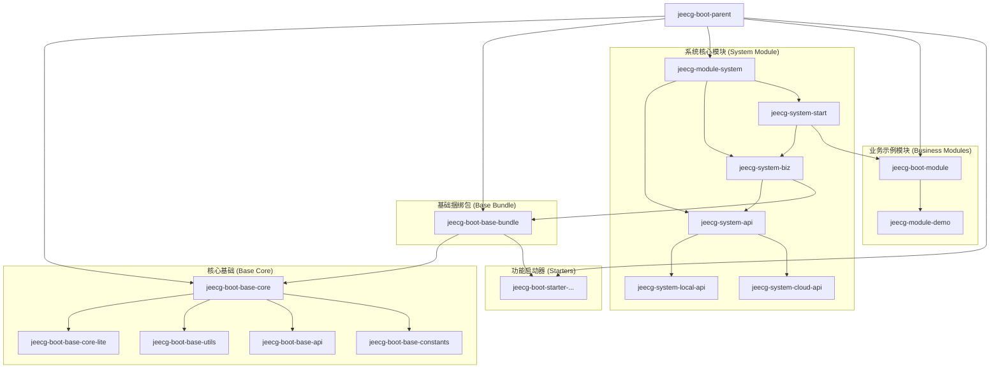

# JeecgBoot Maven 模块结构指南

本文档旨在提供对 `jeecg-boot` 项目 Maven 模块结构的全面理解，阐明各模块的职责、关系以及它们如何协同工作。

## 模块关系图

## 模块职责详解

### 1. `jeecg-boot-parent`
- **类型**: `pom`
- **职责**: 项目的顶层父 POM。它定义了整个项目共享的依赖版本（通过 `<dependencyManagement>`）、插件版本（通过 `<pluginManagement>`）、仓库配置和全局属性。所有其他模块都直接或间接地继承自该 POM。

### 2. `jeecg-boot-base-core` (聚合模块)
- **类型**: `pom`
- **职责**: 聚合了最核心、最基础的模块，这些模块不依赖于具体的业务或框架实现。
- **子模块**:
    - `jeecg-boot-base-core-lite`: 轻量级核心，包含最基本的工具和类。
    - `jeecg-boot-base-utils`: 提供了项目范围内的通用工具类。
    - `jeecg-boot-base-api`: 定义了基础的 API 接口。
    - `jeecg-boot-base-constants`: 存放全局共享的常量。

### 3. `jeecg-boot-base-bundle`
- **类型**: `jar`
- **职责**: 这是一个“捆绑”模块，它将所有 `jeecg-boot-starter-*` 和核心基础模块 (`jeecg-boot-base-core`) 作为依赖项聚合在一起。其他业务模块（如 `jeecg-system-biz`）可以直接依赖此模块，从而一次性引入所有必需的基础设施和功能，极大地简化了依赖管理。

### 4. `jeecg-boot-starter-*` (系列模块)
- **类型**: `jar`
- **职责**: 遵循 Spring Boot 的 "starter" 模式，提供特定功能的自动化配置和依赖。例如：
    - `jeecg-boot-starter-oss`: 对象存储服务集成。
    - `jeecg-boot-starter-security`: 安全和权限控制。
    - `jeecg-boot-starter-web`: Web 开发相关的核心配置。
    - ...等等。
- **特点**: 这些 starter 被 `jeecg-boot-base-bundle` 统一引入，供上层业务模块使用。

### 5. `jeecg-module-system` (聚合模块)
- **类型**: `pom`
- **职责**: 聚合了所有与“系统管理”功能相关的模块，是平台的核心业务实现。
- **子模块**:
    - `jeecg-system-api`: 定义系统模块对外暴露的 API 接口，分为本地调用 (`local-api`) 和云服务调用 (`cloud-api`)。
    - `jeecg-system-biz`: 系统模块的核心业务逻辑实现。它依赖 `jeecg-system-api` 和 `jeecg-boot-base-bundle`。
    - `jeecg-system-start`: 项目的**主启动模块**。它负责打包成最终的可执行 Spring Boot 应用，并依赖 `jeecg-system-biz` 和其他需要启动时包含的模块。

### 6. `jeecg-boot-module` (聚合模块)
- **类型**: `pom`
- **职责**: 聚合了所有独立的业务功能模块。设计上用于解耦，允许开发者添加新的业务模块。
- **子模块**:
    - `jeecg-module-demo`: 一个示例业务模块，展示了如何开发和集成新的业务功能。

## 依赖管理策略总结

- **版本集中管理**: 所有依赖项的版本号都在顶层 `jeecg-boot-parent` 的 `<properties>` 和 `<dependencyManagement>` 中统一定义。
- **依赖捆绑引入**: `jeecg-boot-base-bundle` 模块将所有基础 starter 和核心库捆绑在一起，业务模块通过依赖它来简化自身的 `pom.xml`。
- **分层设计**:
    - **底层**: `jeecg-boot-base-core` 提供无业务耦合的基础工具。
    - **中间层**: `jeecg-boot-starter-*` 提供可插拔的功能组件。
    - **捆绑层**: `jeecg-boot-base-bundle` 聚合中间层和底层。
    - **业务层**: `jeecg-module-system` 和 `jeecg-boot-module` 下的模块实现具体业务逻辑，依赖捆绑层。
    - **启动层**: `jeecg-system-start` 负责整合所有需要的业务模块并打包启动。

这种结构使得项目层次清晰、易于扩展和维护。