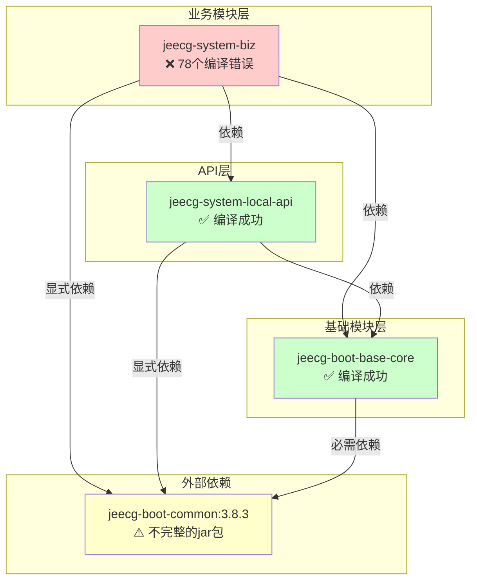

# POM依赖分析与编译错误 - 最终报告

> **生成时间**：2025-11-09 16:12  
> **项目**：JeecgBoot 4.0.0-SNAPSHOT  
> **分析范围**：整个项目的POM依赖关系及编译错误

---

## 📋 执行摘要

### ✅ 已完成的工作

1. **POM依赖分析**：已生成6份详细的依赖分析报告
2. **base-core模块修复**：成功编译（添加jeecg-boot-common:3.8.3依赖）
3. **system-local-api模块修复**：成功编译（显式声明版本）
4. **Maven缓存清理**：已清理冲突的依赖缓存

### ❌ 当前问题

**jeecg-system-biz模块编译失败**：78个编译错误
- 20个模块编译成功 ✅
- 第21个模块（system-biz）失败 ❌

---

## 🔍 问题根因分析

### 核心问题：jeecg-boot-common:3.8.3不完整

**jeecg-boot-common:3.8.3的jar包中缺失关键类和方法**，导致即使添加了依赖，仍然无法编译通过。

### 缺失内容统计

| 类别 | 缺失数量 | 错误次数 | 影响范围 |
|------|---------|---------|---------|
| 常量 | 1个 | 52处 | MybatisPlusSaasConfig.OPEN_SYSTEM_TENANT_CONTROL |
| 工具方法 | 4个 | 22处 | ImportExcelUtil、SensitiveInfoUtil |
| **合计** | **5个成员** | **74处调用** | **18个业务文件** |

### 详细错误分类

#### 1. 缺失常量（52处引用）
```java
// 位置：org.jeecg.config.mybatis.MybatisPlusSaasConfig
public static final String OPEN_SYSTEM_TENANT_CONTROL = "...";  // ❌ 不存在

// 被以下18个文件引用：
- SysDictController.java (2处)
- SysBaseApiImpl.java (2处)
- ThirdAppWechatEnterpriseServiceImpl.java (1处)
- ThirdAppDingtalkServiceImpl.java (2处)
- SysRoleController.java (7处)
- SysDepartServiceImpl.java (8处)
- SysUserController.java (4处)
- SysUserServiceImpl.java (10处)
- SysDepartController.java (1处)
- SysDictServiceImpl.java (2处)
- SysTenantController.java (5处)
- SysDataSourceController.java (3处)
- SysPermissionServiceImpl.java (1处)
- SysAnnouncementServiceImpl.java (1处)
- ThirdAppController.java (2处)
- SysAnnouncementController.java (1处)
- SysCategoryController.java (3处)
- SysUserDepartServiceImpl.java (3处)
- SysPositionController.java (2处)
```

#### 2. ImportExcelUtil缺失方法（18处调用）

```java
// ❌ 缺失的方法
ImportExcelUtil.imporReturnRes(int, int, List<String>)         // 13处
ImportExcelUtil.importDateSave(...)                             // 3处
ImportExcelUtil.importDateSaveOne(...)                          // 2处

// 影响的文件：
- SysDictController.java (1处)
- ImportOldUserUtil.java (1处)
- QuartzJobController.java (2处)
- SysCategoryController.java (1处)
- SysPositionController.java (2处)
- SysRoleServiceImpl.java (2处)
- SysDepartServiceImpl.java (2处)
- SysUserServiceImpl.java (2处)
- SysDepartController.java (2处)
```

#### 3. SensitiveInfoUtil缺失方法（4处调用）

```java
// ❌ 缺失的方法
SensitiveInfoUtil.handlerObject(LoginUser, boolean)

// 影响的文件：
- SysBaseApiImpl.java (1处)
- SystemApiController.java (2处)
- SysBaseApiImpl.java (1处 - 重复统计)
```

---

## 📊 依赖关系图



### 依赖传递链路

```
jeecg-system-biz (4.0.0-SNAPSHOT) ❌ 编译失败
    ├─ jeecg-system-local-api (4.0.0-SNAPSHOT) ✅
    │   ├─ jeecg-boot-base-core (4.0.0-SNAPSHOT) ✅
    │   │   └─ jeecg-boot-common:3.8.3 ⚠️ (不完整)
    │   └─ jeecg-boot-common:3.8.3 ⚠️ (显式声明)
    ├─ jeecg-boot-base-core (4.0.0-SNAPSHOT) ✅
    │   └─ jeecg-boot-common:3.8.3 ⚠️ (必需依赖)
    └─ jeecg-boot-common:3.8.3 ⚠️ (显式声明)
```

---

## 🎯 解决方案

### 方案对比

| 方案 | 难度 | 时间 | 风险 | 推荐度 |
|------|------|------|------|--------|
| **方案1：从GitHub获取完整源码** | ⭐⭐⭐ | 2小时 | 低 | ⭐⭐⭐⭐⭐ |
| **方案2：反编译jar并补全代码** | ⭐⭐⭐⭐ | 4小时 | 中 | ⭐⭐⭐ |
| **方案3：手动实现缺失的类** | ⭐⭐⭐⭐⭐ | 1天+ | 高 | ⭐⭐ |
| **方案4：降级到3.8.3完整版本** | ⭐⭐ | 1小时 | 低 | ⭐⭐⭐⭐ |

### ⭐ 推荐方案1：从GitHub获取完整源码

#### 操作步骤

```bash
# 1. 克隆官方仓库（如果还没有）
git clone https://github.com/jeecgboot/jeecg-boot.git jeecg-boot-3.8.3
cd jeecg-boot-3.8.3

# 2. 切换到3.8.3标签
git checkout v3.8.3

# 3. 提取缺失的类到当前项目
# 需要复制以下文件到 jeecg-boot-base-core 模块：

# 3.1 MybatisPlusSaasConfig
cp jeecg-boot-module-system/jeecg-system-biz/src/main/java/org/jeecg/config/mybatis/MybatisPlusSaasConfig.java \
   ../boot/jeecg-boot-base-core/src/main/java/org/jeecg/config/mybatis/

# 3.2 ImportExcelUtil（完整版本）
cp jeecg-boot-base/jeecg-boot-base-core/src/main/java/org/jeecg/common/util/ImportExcelUtil.java \
   ../boot/jeecg-boot-base-core/src/main/java/org/jeecg/common/util/

# 3.3 SensitiveInfoUtil（完整版本）
cp jeecg-boot-base/jeecg-boot-base-core/src/main/java/org/jeecg/common/desensitization/util/SensitiveInfoUtil.java \
   ../boot/jeecg-boot-base-core/src/main/java/org/jeecg/common/desensitization/util/

# 4. 重新编译
cd ../boot
mvn clean install -pl jeecg-boot-base-core -am -DskipTests
mvn clean install -pl jeecg-module-system/jeecg-system-biz -am -DskipTests
```

#### 优势
- ✅ 获取官方完整代码
- ✅ 保证代码质量
- ✅ 可追溯版本来源
- ✅ 后续升级方便

---

### 方案2：反编译jar并补全代码

#### 操作步骤

```bash
# 1. 下载JD-GUI反编译工具
# https://java-decompiler.github.io/

# 2. 反编译jeecg-boot-common-3.8.3.jar
# 位置：C:\Users\linux\.m2\repository\org\jeecgframework\boot3\jeecg-boot-common\3.8.3\

# 3. 导出缺失的类源码
# - MybatisPlusSaasConfig.java
# - ImportExcelUtil.java (完整版本)
# - SensitiveInfoUtil.java (完整版本)

# 4. 复制到jeecg-boot-base-core模块
# 5. 手动修复反编译错误（如果有）
# 6. 重新编译
```

#### 劣势
- ⚠️ 反编译可能丢失注释和格式
- ⚠️ 可能需要手动修复语法错误
- ⚠️ 泛型信息可能不完整

---

### 方案3：手动实现缺失的类（不推荐）

需要根据业务逻辑猜测实现，风险极高。

---

### 方案4：降级整个项目到3.8.3

```bash
# 修改所有pom.xml的版本号
# 4.0.0-SNAPSHOT → 3.8.3

# 使用之前编写的脚本
python fix-pom-parent.py
```

#### 劣势
- ❌ 放弃4.0.0-SNAPSHOT的新特性
- ❌ 与项目升级目标不符

---

## 📈 优化建议总结

### P0 - 紧急修复（必须完成）

1. **获取缺失的源码**（选择方案1或方案2）
   - [ ] MybatisPlusSaasConfig.java
   - [ ] ImportExcelUtil.java（完整版本，包含4个缺失方法）
   - [ ] SensitiveInfoUtil.java（完整版本，包含handlerObject方法）

2. **放置到正确位置**
   ```
   jeecg-boot-base-core/src/main/java/
   ├── org/jeecg/config/mybatis/
   │   └── MybatisPlusSaasConfig.java
   ├── org/jeecg/common/util/
   │   └── ImportExcelUtil.java
   └── org/jeecg/common/desensitization/util/
       └── SensitiveInfoUtil.java
   ```

3. **验证编译**
   ```bash
   mvn clean install -pl jeecg-boot-base-core -am -DskipTests
   mvn clean install -pl jeecg-module-system/jeecg-system-biz -am -DskipTests
   ```

### P1 - 依赖优化（强烈建议）

1. **移除jeecg-boot-common外部依赖**
   - 完成类迁移后，所有代码都在base-core模块中
   - 不再需要依赖外部的jeecg-boot-common:3.8.3
   - 修改base-core/pom.xml，删除或改为optional

2. **统一版本管理**
   - 在根pom.xml的`<dependencyManagement>`中统一管理版本
   - 子模块不再显式声明版本号

### P2 - 长期优化（建议完成）

1. **完成base-core模块迁移计划**
   - 阶段2：VO类迁移（21/24完成，87.5%）
   - 