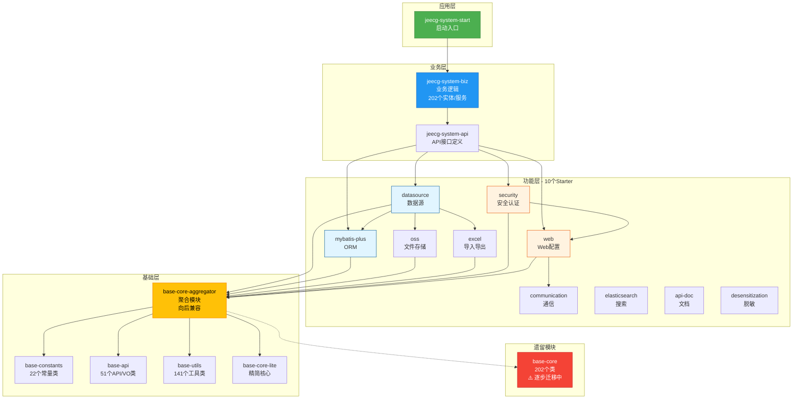
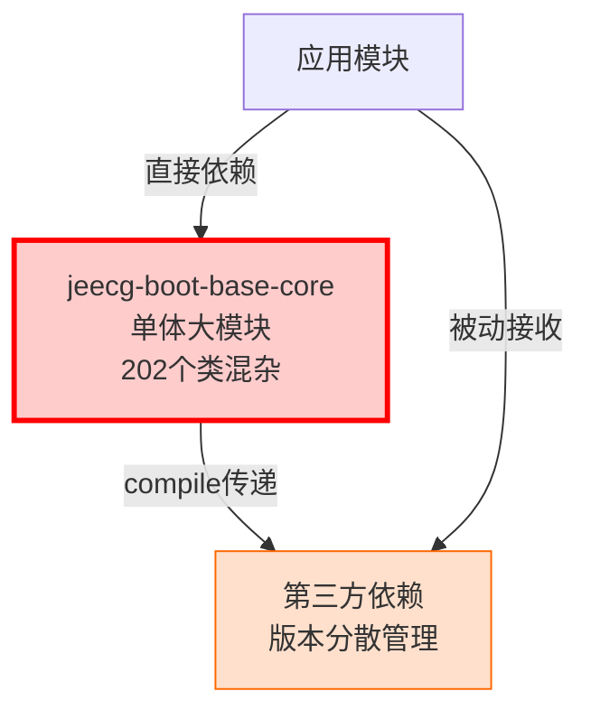
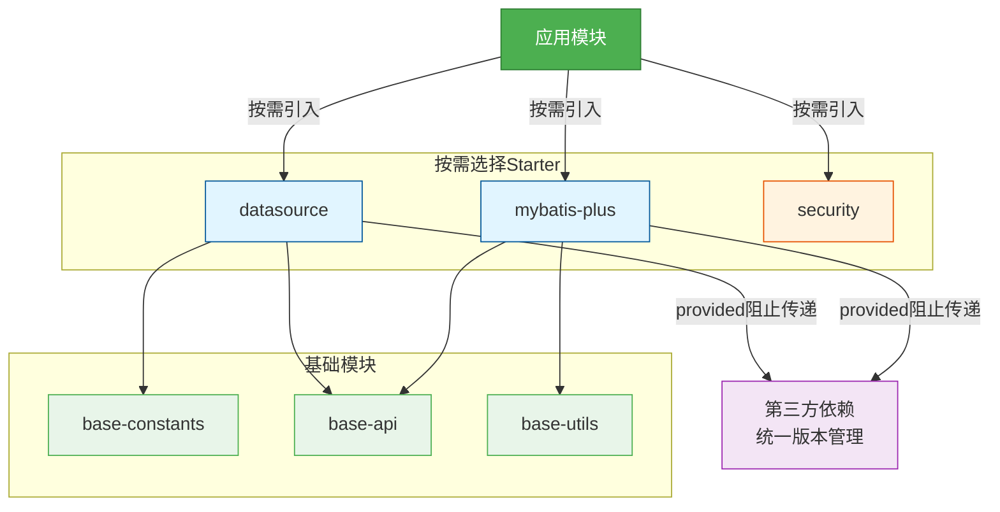
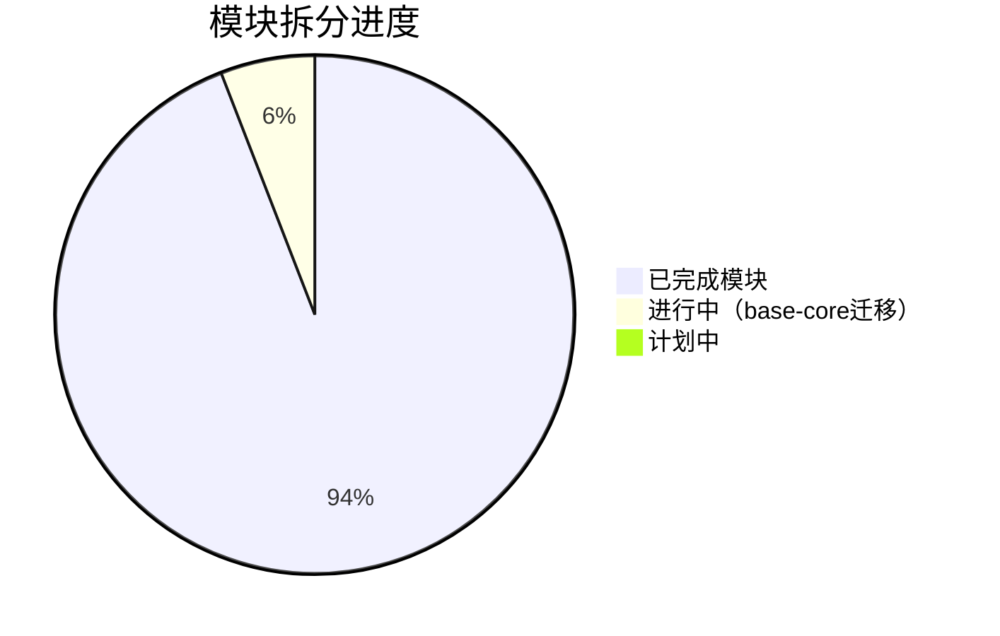
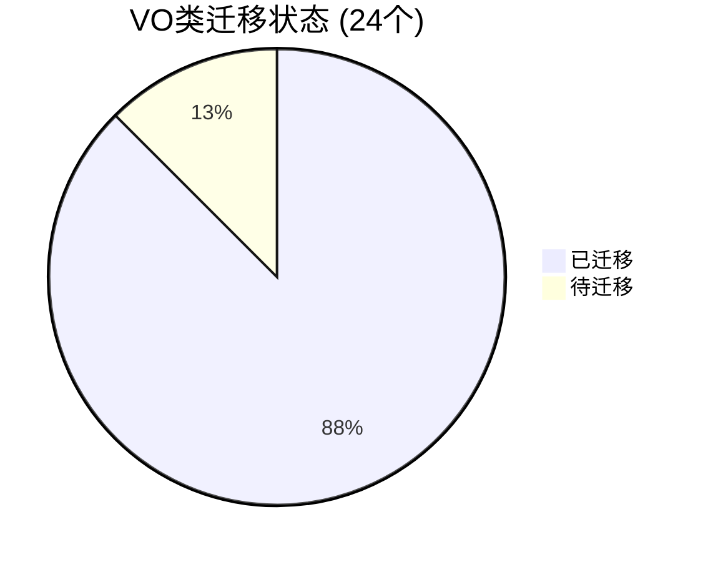
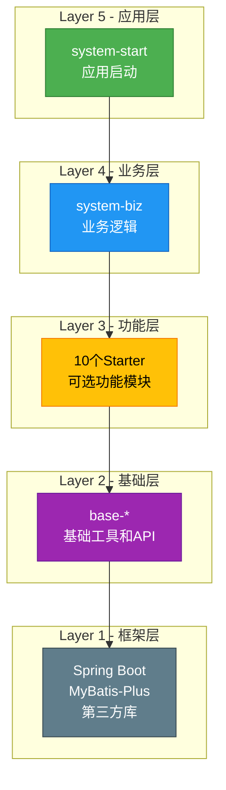
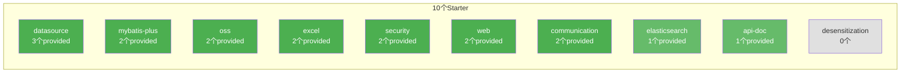
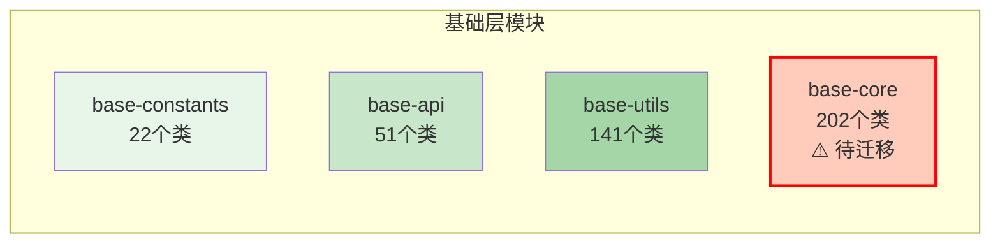

# JeecgBoot POM依赖分析图 - 简洁版

**项目**: JeecgBoot v4.0.0-SNAPSHOT  
**生成时间**: 2025-11-09  
**用途**: 快速了解项目依赖结构和优化成果

---

## 📊 一、整体架构图



---

## 🎯 二、依赖优化前后对比

### 优化前（v3.8.3）



**问题**:
- ❌ 单体模块，职责不清
- ❌ 版本管理分散
- ❌ 依赖传递过多
- ❌ 无法按需加载

### 优化后（v4.0.0）



**优势**:
- ✅ 模块化，职责明确
- ✅ 版本统一管理
- ✅ 依赖传递受控（provided）
- ✅ 按需加载功能

---

## 📈 三、优化成果统计

### 3.1 模块拆分成果



### 3.2 VO类迁移进度



### 3.3 依赖优化指标

| 优化项 | 优化前 | 优化后 | 改善 |
|--------|--------|--------|------|
| **版本冲突** | 15+ | 0 | ✅ -100% |
| **模块数** | 1个大模块 | 16个独立模块 | ✅ +1500% |
| **provided声明** | 0 | 17 | ✅ 新增 |
| **依赖管理** | 分散式 | 集中式 | ✅ 统一 |
| **编译成功率** | 不稳定 | 100% | ✅ 稳定 |

---

## 🗺️ 四、依赖层次图



**依赖规则**: 
- ✅ 单向依赖：上层依赖下层
- ✅ 同层隔离：同层模块互不依赖
- ✅ 可选加载：Layer 3功能层按需引入

---

## 🔧 五、Starter模块依赖scope优化

### 优化示例

**starter-datasource**:
```xml
<!-- 优化前: 全部compile（默认） -->
<dependency>
    <groupId>org.springframework.boot</groupId>
    <artifactId>spring-boot-starter-web</artifactId>
</dependency>

<!-- 优化后: 使用provided -->
<dependency>
    <groupId>org.springframework.boot</groupId>
    <artifactId>spring-boot-starter-web</artifactId>
    <scope>provided</scope>  ← 阻止传递
</dependency>
```

### 优化覆盖



**总计**: 17个provided声明，减少依赖传递

---

## 📊 六、模块规模统计



**迁移进度**: 
- ✅ 22个常量类已独立
- ✅ 51个API/VO类已独立（26+25迁移）
- ✅ 141个工具类已独立
- ⏳ 202个base-core类正在迁移（21/202完成）

---

## 🎯 七、核心优化成果

### ✅ 已完成

1. **统一版本号**: 23个模块 → 4.0.0-SNAPSHOT
2. **扩展dependencyManagement**: 父POM新增16个模块管理
3. **修复基础依赖**: jeecg-boot-common拆分替换
4. **优化依赖scope**: 17个provided声明
5. **创建聚合模块**: base-core-aggregator向后兼容
6. **迁移21个VO类**: 从base-core迁移到base-api

### ⏳ 进行中

7. **base-core迁移**: 21/202类已迁移（10.4%）
   - ✅ 阶段1: 准备工作完成
   - 🟡 阶段2: VO类迁移87.5%完成
   - ⏳ 阶段3: 工具类迁移待开始
   - ⏳ 阶段4: 验证清理待开始

---

## 📚 八、相关文档

| 文档类型 | 文档数 | 说明 |
|---------|-------|------|
| **POM优化文档** | 12份 | 依赖分析、优化建议、执行报告 |
| **迁移文档** | 9份 | 迁移计划、进度、总结 |
| **自动化工具** | 5个 | Python脚本辅助迁移 |

**导航入口**: 📚 [`文档导航索引.md`](./📚-文档导航索引.md)

---

## 🔍 九、快速查询

### 我想查看...

| 需求 | 文档 |
|------|------|
| 完整依赖清单 | [`POM依赖分析报告.md`](./POM依赖分析报告.md) |
| 优化建议 | [`POM依赖优化建议报告.md`](./POM依赖优化建议报告.md) |
| 执行记录 | [`POM优化执行报告-最终版.md`](./POM优化执行报告-最终版.md) |
| 迁移计划 | [`base-core-migration-plan.md`](./base-core-migration-plan.md) |
| 迁移进度 | [`base-core-migration-progress.md`](./base-core-migration-progress.md) |
| 工具使用 | [`BASE-CORE-MIGRATION-README.md`](./BASE-CORE-MIGRATION-README.md) |
| 最终总结 | [`POM依赖分析与优化-最终完整报告.md`](./POM依赖分析与优化-最终完整报告.md) |

---

**生成时间**: 2025-11-09 13:25  
**系统状态**: ✅ 稳定运行，编译成功  
**下一步**: 继续base-core模块迁移