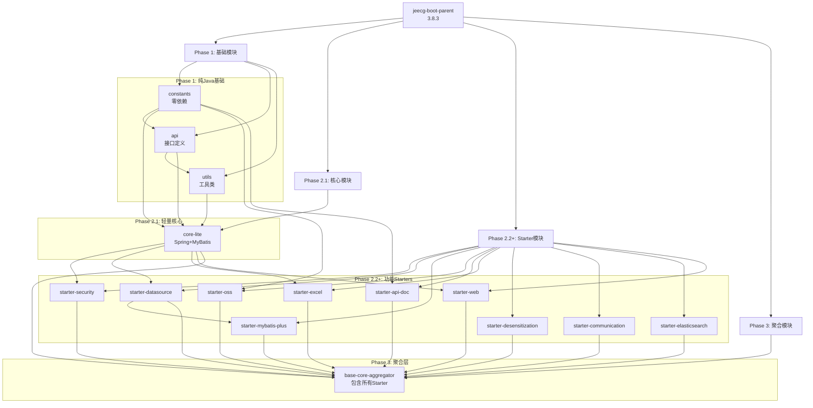
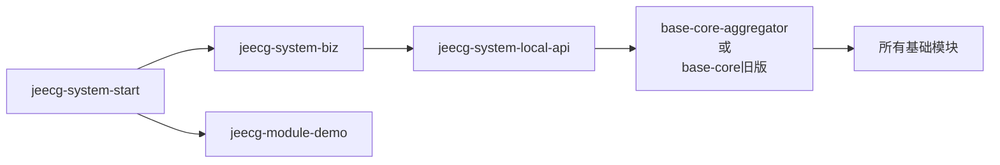

# JeecgBoot 项目 POM 依赖分析报告

> 生成时间: 2025-11-09
> 分析范围: 全项目 Maven POM 文件
> 项目版本: 3.8.3 (新架构 4.0.0-SNAPSHOT)

---

## 📊 一、项目结构概览

### 1.1 父POM信息
- **GroupId**: `org.jeecgframework.boot3`
- **ArtifactId**: `jeecg-boot-parent`
- **Version**: `3.8.3`
- **Parent**: `spring-boot-starter-parent:3.1.12`
- **Java版本**: 17
- **打包类型**: pom (聚合项目)

### 1.2 模块层次结构

```
jeecg-boot-parent (3.8.3)
├── 📦 Phase 1: 纯Java基础模块 (v4.0.0-SNAPSHOT)
│   ├── jeecg-boot-base-constants     [零依赖常量]
│   ├── jeecg-boot-base-api          [API接口定义]
│   └── jeecg-boot-base-utils        [纯Java工具类]
│
├── 📦 Phase 2.1: 轻量级Spring核心 (v4.0.0-SNAPSHOT)
│   └── jeecg-boot-base-core-lite    [Spring集成+CRUD]
│
├── 📦 Phase 2.2+: 功能Starter模块 (v4.0.0-SNAPSHOT)
│   ├── jeecg-boot-starter-security       [安全认证]
│   ├── jeecg-boot-starter-datasource     [数据源]
│   ├── jeecg-boot-starter-mybatis-plus   [MyBatis增强]
│   ├── jeecg-boot-starter-oss            [对象存储]
│   ├── jeecg-boot-starter-api-doc        [API文档]
│   ├── jeecg-boot-starter-excel          [Excel处理]
│   ├── jeecg-boot-starter-desensitization [数据脱敏]
│   ├── jeecg-boot-starter-communication  [通信服务]
│   ├── jeecg-boot-starter-elasticsearch  [搜索引擎]
│   └── jeecg-boot-starter-web            [Web增强]
│
├── 📦 Phase 3: 向后兼容聚合模块 (v4.0.0-SNAPSHOT)
│   └── jeecg-boot-base-core-aggregator   [全功能聚合包]
│
├── 📦 原有模块 (v3.8.3)
│   ├── jeecg-boot-base-core          [旧版核心模块]
│   ├── jeecg-module-system/          [系统模块]
│   │   ├── jeecg-system-api/
│   │   │   └── jeecg-system-local-api
│   │   ├── jeecg-system-biz
│   │   └── jeecg-system-start
│   └── jeecg-boot-module/            [业务模块]
│
└── 📦 微服务模块 (可选)
    └── jeecg-server-cloud/           [SpringCloud]
```

---

## 🔗 二、依赖关系分析图

### 2.1 新架构依赖链 (v4.0.0)



### 2.2 业务模块依赖链



---

## 📋 三、详细依赖清单

### 3.1 Phase 1: 基础模块依赖

#### jeecg-boot-base-constants (v4.0.0-SNAPSHOT)
**理想目标**: 零依赖  
**实际依赖**:
```xml
<!-- 可选依赖 (optional=true) -->
- spring-context
- spring-core
- commons-lang3
- fastjson (2.0.57)
```
**⚠️ 问题**: 包含了 `ProvinceCityArea` 等有依赖的类

---

#### jeecg-boot-base-api (v4.0.0-SNAPSHOT)
**定位**: API接口、DTO、VO、异常类定义

**核心依赖**:
```xml
- jeecg-boot-base-constants (内部依赖)

<!-- 编译期依赖 (scope=provided) -->
- spring-boot-starter-web
- mybatis-plus-core
- easypoi-base
- jakarta.servlet-api
- jackson-annotations (optional)
- swagger-annotations-jakarta:2.2.20 (optional)
- spring-context
- lombok (optional)
```

---

#### jeecg-boot-base-utils (v4.0.0-SNAPSHOT)
**定位**: 纯Java工具类模块

**核心依赖**:
```xml
<!-- 内部依赖 -->
- jeecg-boot-base-constants
- jeecg-boot-base-api (optional)

<!-- Apache Commons -->
- commons-lang3
- commons-codec
- commons-io:2.11.0 (optional)
- commons-beanutils:1.9.4 (optional)

<!-- 工具库 -->
- hutool-all:5.8.25
- jsqlparser (optional)
- guava:31.1-jre (optional)

<!-- MyBatis & Spring (可选) -->
- mybatis-plus-core (optional)
- spring-web (optional)
- spring-beans (optional)
- spring-context (optional)
- spring-core (optional)

<!-- 安全相关 (可选) -->
- java-jwt:4.5.0 (optional)
- shiro-core:2.0.4 (optional)

<!-- 其他 -->
- netty-common (optional)
- jackson-databind (optional)
- jakarta.servlet-api (provided)
- slf4j-api (provided, optional)
```

---

### 3.2 Phase 2.1: 核心模块依赖

#### jeecg-boot-base-core-lite (v4.0.0-SNAPSHOT)
**定位**: 轻量级Spring核心，提供基础CRUD能力

**核心依赖**:
```xml
<!-- 内部依赖 -->
- jeecg-boot-base-constants
- jeecg-boot-base-api
- jeecg-boot-base-utils

<!-- Spring Boot 核心 -->
- spring-boot-starter
- spring-boot-starter-web
- spring-boot-configuration-processor (optional)

<!-- MyBatis-Plus -->
- mybatis-plus-boot-starter:3.5.5

<!-- 数据库驱动 (可选) -->
- mysql-connector-java (optional)
- postgresql (optional)

<!-- 工具库 -->
- hutool-all:5.8.25
- lombok (optional)

<!-- Redis (可选) -->
- spring-boot-starter-data-redis (optional)

<!-- 模板引擎 (可选) -->
- freemarker (optional)

<!-- Shiro (可选) -->
- shiro-spring-boot-web-starter:1.13.0 (optional)

<!-- Excel (可选) -->
- easypoi-spring-boot-starter:4.4.0 (optional)

<!-- Swagger (可选) -->
- swagger-annotations:2.2.8 (optional)

<!-- 其他 -->
- commons-beanutils (optional)
- javax.servlet-api (provided)
```

---

### 3.3 Phase 2.2+: Starter模块依赖

#### jeecg-boot-starter-datasource (v4.0.0-SNAPSHOT)

**核心依赖**:
```xml
<!-- 内部依赖 -->
- jeecg-boot-base-constants
- jeecg-boot-base-api
- jeecg-boot-base-utils
- jeecg-boot-base-core-lite

<!-- Spring Boot -->
- spring-boot-starter-jdbc
- spring-boot-starter-web
- spring-boot-configuration-processor (optional)

<!-- 数据源 -->
- druid-spring-boot-3-starter:1.2.24
- dynamic-datasource-spring-boot3-starter:4.3.1 (optional)

<!-- 其他 -->
- freemarker
- spring-boot-starter-data-redis (optional)
- mysql-connector-j (provided, optional)
- postgresql (provided, optional)
- jakarta.servlet-api (provided)
```

---

#### jeecg-boot-starter-mybatis-plus (v4.0.0-SNAPSHOT)

**核心依赖**:
```xml
<!-- 内部依赖 -->
- jeecg-boot-base-constants
- jeecg-boot-base-api
- jeecg-boot-base-utils
- jeecg-boot-base-core-lite
- jeecg-boot-starter-datasource

<!-- MyBatis-Plus -->
- mybatis-plus-spring-boot3-starter:3.5.5
- mybatis-plus-extension:3.5.5
- jsqlparser:4.6

<!-- Spring Boot -->
- spring-boot-starter (provided)
- spring-boot-starter-web (provided)
- spring-boot-starter-aop (provided)
- spring-boot-configuration-processor (optional)

<!-- 数据库驱动 (可选) -->
- mysql-connector-j (runtime, optional)
- postgresql (runtime, optional)
- mssql-jdbc (runtime, optional)
- ojdbc8 (runtime, optional)

<!-- Redis -->
- spring-boot-starter-data-redis (optional)

<!-- 工具库 -->
- hutool-all:5.8.23
- fastjson2:2.0.43
```

---

#### jeecg-boot-starter-oss (v4.0.0-SNAPSHOT)

**核心依赖**:
```xml
<!-- 内部依赖 -->
- jeecg-boot-base-constants
- jeecg-boot-base-api
- jeecg-boot-base-utils

<!-- Spring Boot -->
- spring-boot-starter (provided)
- spring-boot-starter-web (provided)
- spring-boot-configuration-processor (optional)

<!-- 对象存储 -->
- minio:8.5.7 (optional)
- aliyun-sdk-oss:3.17.4 (optional)

<!-- 文件上传 -->
- commons-fileupload:1.5

<!-- 工具库 -->
- hutool-all:5.8.23
```

---

#### jeecg-boot-starter-api-doc (v4.0.0-SNAPSHOT)

**核心依赖**:
```xml
<!-- 内部依赖 -->
- jeecg-boot-base-constants

<!-- Spring Boot -->
- spring-boot-starter:3.1.12 (provided)
- spring-boot-starter-web:3.1.12 (provided)
- spring-boot-configuration-processor:3.1.12 (optional)

<!-- API文档 -->
- springfox-boot-starter:3.0.0 (optional)
- knife4j-openapi3-spring-boot-starter:4.5.0 (optional)
- springdoc-openapi-starter-webmvc-ui:2.6.0 (optional)

<!-- 其他 -->
- jakarta.servlet-api:6.0.0 (provided)
```

---

#### jeecg-boot-starter-web (v4.0.0-SNAPSHOT)

**核心依赖**:
```xml
<!-- 内部依赖 -->
- jeecg-boot-base-constants
- jeecg-boot-base-api
- jeecg-boot-base-utils
- jeecg-boot-base-core-lite

<!-- Spring Boot -->
- spring-boot-starter-web
- spring-boot-starter-aop
- spring-boot-configuration-processor (optional)
- spring-boot-starter-undertow (optional)

<!-- Servlet -->
- javax.servlet-api (provided)

<!-- Jackson -->
- jackson-databind

<!-- 其他 -->
- commons-beanutils:1.9.4
- jakarta.validation-api
```

---

### 3.4 Phase 3: 聚合模块

#### jeecg-boot-base-core-aggregator (v4.0.0-SNAPSHOT)

**定位**: 向后兼容层，包含所有Starter

**核心依赖**:
```xml
<!-- 基础模块 -->
- jeecg-boot-base-constants
- jeecg-boot-base-api
- jeecg-boot-base-utils
- jeecg-boot-base-core-lite

<!-- 所有 Starter -->
- jeecg-boot-starter-security
- jeecg-boot-starter-datasource
- jeecg-boot-starter-mybatis-plus
- jeecg-boot-starter-oss
- jeecg-boot-starter-api-doc
- jeecg-boot-starter-excel
- jeecg-boot-starter-desensitization
- jeecg-boot-starter-communication
- jeecg-boot-starter-elasticsearch
- jeecg-boot-starter-web
```

---

### 3.5 原有模块 (v3.8.3)

#### jeecg-boot-base-core (旧版核心)

**特点**: 大而全的单体模块

**主要依赖** (精简列表):
```xml
<!-- JeecgBoot工具类 -->
- jeecg-boot-common

<!-- Spring Boot -->
- spring-boot-starter-web
- spring-boot-starter-websocket
- spring-boot-starter-mail
- spring-boot-starter-aop
- spring-boot-starter-actuator
- spring-boot-starter-validation
- spring-boot-starter-freemarker
- spring-boot-starter-quartz

<!-- MyBatis-Plus -->
- 