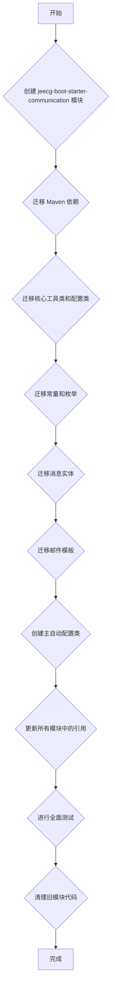

# jeecg-boot-base-core 通信模块迁移到 jeecg-boot-starter-communication 方案

## 1. 目标

将 `jeecg-boot-base-core` 模块中与短信 (SMS)、WebSocket 和邮件 (Email) 相关的通信功能迁移到一个独立的 Spring Boot Starter 模块 `jeecg-boot-starter-communication` 中，以提高模块的内聚性、可维护性和可插拔性。

## 2. 当前通信模块分布情况

通过对 `jeecg-boot-base-core/pom.xml`、`jeecg-boot-base-core/src/main/java` 和 `jeecg-module-system/jeecg-system-biz/src/main/java` 目录的分析，发现以下通信相关模块：

### 2.1. 短信 (SMS)

*   **核心逻辑:**
    *   [`DySmsHelper.java`](jeecg-boot-base-core/src/main/java/org/jeecg/common/util/DySmsHelper.java:6): 阿里云短信发送的核心逻辑。
    *   [`SmsSendMsgHandle.java`](jeecg-module-system/jeecg-system-biz/src/main/java/org/jeecg/modules/message/handle/impl/SmsSendMsgHandle.java:11): `ISendMsgHandle` 接口的短信实现。
*   **配置:**
    *   [`JeecgSmsTemplateConfig.java`](jeecg-boot-base-core/src/main/java/org/jeecg/config/JeecgSmsTemplateConfig.java:15): 短信模板相关的配置类。
    *   `StaticConfig.java`: 包含 `DySmsHelper` 的初始化逻辑。
*   **限制/校验:**
    *   [`DySmsLimit.java`](jeecg-boot-base-core/src/main/java/org/jeecg/common/util/DySmsLimit.java:7): 短信发送频率限制工具类。
*   **API/Controller:**
    *   `LoginController.java`: 处理 `/sys/sms` (发送短信验证码)、`/sys/sendChangePwdSms` (发送修改密码短信)、`/sys/smsCheckCaptcha` (短信验证码校验) 等接口。
    *   `SysUserController.java`: 处理 `/sys/sendChangePhoneSms` (发送修改手机号短信)、`/sys/sendLogOffPhoneSms` (发送注销手机号短信) 等接口。
    *   `SystemApiController.java`: 提供 `/sys/sendSmsMsg` 接口。
*   **常量/枚举:**
    *   `CommonConstant.java`: 定义短信模板类型、手机短信失败代码等常量。
    *   `DySmsEnum.java`: 定义短信模板编码、签名和键的枚举。
*   **实体/VO:**
    *   `SysMessageTemplate.java`: 对应数据库表 `sys_sms_template`。
    *   `SysMessage.java`: 对应数据库表 `sys_sms`。
*   **依赖:**
    *   `aliyun-java-sdk-dysmsapi`
    *   `aliyun-java-sdk-core`

### 2.2. WebSocket

*   **核心逻辑:**
    *   [`WebSocket.java`](jeecg-module-system/jeecg-system-biz/src/main/java/org/jeecg/modules/message/websocket/WebSocket.java:25): WebSocket 服务端点，处理连接、断开、消息发送等。
    *   [`SocketHandler.java`](jeecg-module-system/jeecg-system-biz/src/main/java/org/jeecg/modules/message/websocket/SocketHandler.java:17): Redis 消息监听处理，用于集群环境下的消息广播。
*   **配置:**
    *   [`WebSocketConfig.java`](jeecg-boot-base-core/src/main/java/org/jeecg/config/WebSocketConfig.java:14): WebSocket 配置类。
    *   `UndertowCustomizer.java`: 包含 Undertow WebSocket 的配置（注释掉）。
*   **过滤器:**
    *   [`WebsocketFilter.java`](jeecg-boot-base-core/src/main/java/org/jeecg/config/filter/WebsocketFilter.java:21): WebSocket 连接的 Token 安全校验。
*   **API/Controller:**
    *   `SysAnnouncementController.java`: 用于推送公告消息。
    *   `TestSocketController.java`: 用于测试 WebSocket 功能。
    *   `SystemApiController.java`: 提供 `/sys/sendWebSocketMsg` (发送 WebSocket 消息)、`/sys/meetingSignWebsocket` (会议签到 WebSocket) 等接口。
*   **常量:**
    *   `WebsocketConst.java`: 定义 WebSocket 相关的常量。
*   **依赖:**
    *   `spring-boot-starter-websocket`

### 2.3. 邮件 (Email)

*   **核心逻辑:**
    *   [`EmailSendMsgHandle.java`](jeecg-module-system/jeecg-system-biz/src/main/java/org/jeecg/modules/message/handle/impl/EmailSendMsgHandle.java:41): `ISendMsgHandle` 接口的邮件实现，包含邮件发送的具体逻辑。
*   **配置:**
    *   `StaticConfig.java`: 包含邮件发送方 (`spring.mail.username`) 的配置。
    *   `MailHealthIndicator.java`: 邮件服务的健康检查。
*   **API/Controller:**
    *   `SystemApiController.java`: 提供 `/sys/sendEmailMsg` (发送邮件消息)、`/sys/sendHtmlTemplateEmail` (发送 HTML 模板邮件) 等接口。
*   **常量/枚举:**
    *   `EmailTemplateEnum.java`: 定义邮件模板名称和路径的枚举。
    *   `MessageTypeEnum.java`: 消息类型枚举，包含邮件消息。
    *   `SysAnnmentTypeEnum.java`: 公告类型枚举，包含邮件类型。
    *   `Vue3MessageHrefEnum.java`: Vue3 消息链接枚举，包含邮件链接。
    *   `CommonSendStatus.java`: 流程催办邮件通知模板常量。
*   **实体/VO:**
    *   `MessageDTO.java`: 包含 `toEmailList`、`ccEmailList` 等邮件接收人信息。
    *   `LoginUser.java`, `SysUser.java`, `SysUserTenantVo.java`, `SysUserImportVo.java`, `SysUserExportVo.java`, `AppExportUserVo.java`, `ComboModel.java`, `UserAccountInfo.java`, `SysUserSysDepPostModel.java`, `SysUserSysDepartModel.java`: 这些 VO/实体中包含 `email` 字段。
*   **依赖:**
    *   `spring-boot-starter-mail`
*   **模板文件:**
    *   `jeecg-boot-base-core/src/main/resources/templates/email/*.ftl`: 邮件模板文件。

## 3. 迁移方案

### 3.1. `jeecg-boot-starter-communication` 模块结构设计

```
jeecg-boot-starter-communication/
├── pom.xml
├── README.md
└── src/
    └── main/
        ├── java/
        │   └── org/
        │       └── jeecg/
        │           └── common/
        │               └── communication/
        │                   ├── sms/
        │                   │   ├── util/
        │                   │   │   ├── DySmsHelper.java
        │                   │   │   └── DySmsLimit.java
        │                   │   └── config/
        │                   │       └── JeecgSmsTemplateConfig.java
        │                   ├── websocket/
        │                   │   ├── config/
        │                   │   │   └── WebSocketConfig.java
        │                   │   ├── filter/
        │                   │   │   └── WebsocketFilter.java
        │                   │   ├── handler/
        │                   │   │   └── SocketHandler.java
        │                   │   └── util/
        │                   │       └── WebSocket.java
        │                   └── mail/
        │                       ├── util/
        │                       │   └── EmailSendMsgHandle.java
        │                       └── config/
        │                           └── MailAutoConfiguration.java (新的自动配置类)
        │           └── config/
        │               └── CommunicationAutoConfiguration.java (主自动配置类，用于集成所有通信方式的配置)
        │           └── modules/
        │               └── message/
        │                   ├── entity/
        │                   │   ├── SysMessage.java
        │                   │   └── SysMessageTemplate.java
        │                   ├── enums/
        │                   │   ├── DySmsEnum.java
        │                   │   ├── EmailTemplateEnum.java
        │                   │   ├── MessageTypeEnum.java
        │                   │   └── SendMsgTypeEnum.java
        │                   └── constant/
        │                       └── WebsocketConst.java
        └── resources/
            ├── META-INF/
            │   └── spring/
            │       └── org.springframework.boot.autoconfigure.AutoConfiguration.imports
            └── templates/
                └── email/
                    ├── bpm_cc_email.ftl
                    ├── bpm_cuiban_email.ftl
                    ├── bpm_new_task_email.ftl
                    └── desform_new_data_email.ftl
```

### 3.2. 迁移优先级

1.  **Maven 依赖**
2.  **核心工具类和配置类**
3.  **常量和枚举**
4.  **消息实体**
5.  **邮件模板**
6.  **自动配置类**
7.  **引用更新**

### 3.3. 详细迁移步骤

1.  **创建 `jeecg-boot-starter-communication` 模块：**
    *   在根目录下创建 `jeecg-boot-starter-communication` 文件夹。
    *   创建 `pom.xml` 文件，并添加 `spring-boot-starter-parent` 依赖。
    *   创建 `src/main/java` 和 `src/main/resources` 目录结构。
    *   创建 `README.md` 文件。

2.  **迁移 Maven 依赖：**
    *   将 `jeecg-boot-base-core/pom.xml` 中与短信、WebSocket 和邮件相关的依赖（`spring-boot-starter-websocket`、`spring-boot-starter-mail`、`aliyun-java-sdk-dysmsapi`、`aliyun-java-sdk-core`）剪切并粘贴到 `jeecg-boot-starter-communication/pom.xml` 的 `<dependencies>` 标签中。
    *   在 `jeecg-boot-base-core/pom.xml` 的 `<dependencies>` 标签中添加对 `jeecg-boot-starter-communication` 的依赖。

3.  **迁移核心工具类和配置类：**
    *   **短信：**
        *   将 [`DySmsHelper.java`](jeecg-boot-base-core/src/main/java/org/jeecg/common/util/DySmsHelper.java:6) 移动到 `jeecg-boot-starter-communication/src/main/java/org/jeecg/common/communication/sms/util/`。
        *   将 [`DySmsLimit.java`](jeecg-boot-base-core/src/main/java/org/jeecg/common/util/DySmsLimit.java:7) 移动到 `jeecg-boot-starter-communication/src/main/java/org/jeecg/common/communication/sms/util/`。
        *   将 [`JeecgSmsTemplateConfig.java`](jeecg-boot-base-core/src/main/java/org/jeecg/config/JeecgSmsTemplateConfig.java:15) 移动到 `jeecg-boot-starter-communication/src/main/java/org/jeecg/common/communication/sms/config/`。
    *   **WebSocket：**
        *   将 [`WebSocketConfig.java`](jeecg-boot-base-core/src/main/java/org/jeecg/config/WebSocketConfig.java:14) 移动到 `jeecg-boot-starter-communication/src/main/java/org/jeecg/common/communication/websocket/config/`。
        *   将 [`WebsocketFilter.java`](jeecg-boot-base-core/src/main/java/org/jeecg/config/filter/WebsocketFilter.java:21) 移动到 `jeecg-boot-starter-communication/src/main/java/org/jeecg/common/communication/websocket/filter/`。
        *   将 [`WebSocket.java`](jeecg-module-system/jeecg-system-biz/src/main/java/org/jeecg/modules/message/websocket/WebSocket.java:25) 移动到 `jeecg-boot-starter-communication/src/main/java/org/jeecg/common/communication/websocket/util/`。
        *   将 [`SocketHandler.java`](jeecg-module-system/jeecg-system-biz/src/main/java/org/jeecg/modules/message/websocket/SocketHandler.java:17) 移动到 `jeecg-boot-starter-communication/src/main/java/org/jeecg/common/communication/websocket/handler/`。
    *   **邮件：**
        *   将 [`EmailSendMsgHandle.java`](jeecg-module-system/jeecg-system-biz/src/main/java/org/jeecg/modules/message/handle/impl/EmailSendMsgHandle.java:41) 移动到 `jeecg-boot-starter-communication/src/main/java/org/jeecg/common/communication/mail/util/`。
        *   创建 `jeecg-boot-starter-communication/src/main/java/org/jeecg/common/communication/mail/config/MailAutoConfiguration.java` 用于邮件的自动配置。

4.  **迁移常量和枚举：**
    *   将 `WebsocketConst.java` 移动到 `jeecg-boot-starter-communication/src/main/java/org/jeecg/modules/message/constant/`。
    *   将 `DySmsEnum.java` 移动到 `jeecg-boot-starter-communication/src/main/java/org/jeecg/modules/message/enums/`。
    *   将 `EmailTemplateEnum.java` 移动到 `jeecg-boot-starter-communication/src/main/java/org/jeecg/modules/message/enums/`。
    *   将 `MessageTypeEnum.java` 移动到 `jeecg-boot-starter-communication/src/main/java/org/jeecg/modules/message/enums/`。
    *   将 `SendMsgTypeEnum.java` 移动到 `jeecg-boot-starter-communication/src/main/java/org/jeecg/modules/message/enums/`。

5.  **迁移消息实体：**
    *   将 [`SysMessage.java`](jeecg-module-system/jeecg-system-biz/src/main/java/org/jeecg/modules/message/entity/SysMessage.java:24) 移动到 `jeecg-boot-starter-communication/src/main/java/org/jeecg/modules/message/entity/`。
    *   将 [`SysMessageTemplate.java`](jeecg-module-system/jeecg-system-biz/src/main/java/org/jeecg/modules/message/entity/SysMessageTemplate.java:21) 移动到 `jeecg-boot-starter-communication/src/main/java/org/jeecg/modules/message/entity/`。

6.  **迁移邮件模板：**
    *   将 `jeecg-boot-base-core/src/main/resources/templates/email/*.ftl` 下的所有文件移动到 `jeecg-boot-starter-communication/src/main/resources/templates/email/`。

7.  **创建主自动配置类：**
    *   创建 `jeecg-boot-starter-communication/src/main/java/org/jeecg/config/CommunicationAutoConfiguration.java`，用于统一配置和初始化所有通信组件。
    *   在 `jeecg-boot-starter-communication/src/main/resources/META-INF/spring/org.springframework.boot.autoconfigure.AutoConfiguration.imports` 中注册 `CommunicationAutoConfiguration`。

8.  **更新引用：**
    *   在 `jeecg-boot-base-core` 和 `jeecg-module-system/jeecg-system-biz` 中，更新所有被迁移类的 `import` 语句。
    *   修改 `StaticConfig.java` 中与通信相关的初始化逻辑，使其调用 `CommunicationAutoConfiguration` 或移除相关代码。
    *   调整 `SysBaseApiImpl.java`、`LoginController.java`、`SysUserController.java`、`SysAnnouncementController.java`、`TestSocketController.java` 等文件中对通信功能的引用。

### 3.4. 潜在风险和注意事项

1.  **编译错误和运行时错误：**
    *   **风险：** 大量的类和依赖迁移可能导致编译错误，尤其是在 `import` 路径变更后。运行时错误可能由于 Spring 上下文加载顺序、Bean 注入失败或配置读取问题引起。
    *   **缓解措施：**
        *   分阶段迁移：先迁移依赖，然后是核心工具类，再是配置和实体，最后是模板。每完成一个阶段就进行编译和初步测试。
        *   使用 IDE 的重构功能：利用 IDE（如 IntelliJ IDEA）的自动重构功能来批量修改 `import` 语句，减少手动修改的错误。
        *   详细的日志记录：在新的自动配置类和关键通信逻辑中增加详细的日志，以便在出现问题时快速定位。
        *   逐步替换：对于 `StaticConfig.java` 中的初始化，可以先在新模块中实现自动配置，然后逐步移除旧模块中的相关代码。

2.  **Spring Bean 冲突或无法找到：**
    *   **风险：** 迁移后，Spring 容器可能无法正确识别或注入新的 Bean，或者出现 Bean 名称冲突。
    *   **缓解措施：**
        *   确保新的自动配置类 (`CommunicationAutoConfiguration.java`) 被正确注册到 Spring Boot 的自动配置机制中（通过 `META-INF/spring/org.springframework.boot.autoconfigure.AutoConfiguration.imports`）。
        *   检查 `@Component`、`@Service`、`@Configuration` 等注解是否正确应用到迁移后的类上。
        *   对于需要 `@Autowired` 注入的 Bean，确保其在新模块中是可用的。

3.  **配置属性丢失或不生效：**
    *   **风险：** 原本在 `application.yml` 或 `application.properties` 中配置的短信、邮件相关属性，在迁移后可能无法被新模块正确读取。
    *   **缓解措施：**
        *   在新模块中创建 `@ConfigurationProperties` 类来绑定相关的配置属性，确保与旧模块的属性名称保持一致。
        *   在 `CommunicationAutoConfiguration.java` 中引用这些 `@ConfigurationProperties` 类。
        *   在迁移方案文档中明确列出所有需要检查和验证的配置属性。

4.  **WebSocket 连接问题：**
    *   **风险：** WebSocket 的连接和消息推送可能受到影响，例如连接断开、消息丢失或认证失败。
    *   **缓解措施：**
        *   仔细检查 `WebSocketConfig.java` 和 `WebsocketFilter.java` 中的路径配置和 Token 校验逻辑。
        *   确保 Redis 消息发布订阅机制在新模块中正常工作，`SocketHandler` 能够正确接收和处理消息。
        *   进行 WebSocket 连接和消息推送的端到端测试。

5.  **邮件发送失败：**
    *   **风险：** 邮件发送可能因为配置错误、模板路径问题或邮件服务器连接问题而失败。
    *   **缓解措施：**
        *   确保 `MailAutoConfiguration.java` 正确配置了 `JavaMailSender`。
        *   验证邮件模板文件 (`.ftl`) 的路径在新模块中是正确的。
        *   进行邮件发送的集成测试，包括普通邮件和模板邮件。

6.  **数据库表名变更：**
    *   **风险：** `SysMessage` 和 `SysMessageTemplate` 实体类迁移后，如果其 `@TableName` 注解指向的表名发生变化，可能导致数据库操作失败。
    *   **缓解措施：**
        *   确保迁移后的实体类 `@TableName` 注解保持不变，或者在迁移方案中明确指出需要更新数据库表名（如果确实需要）。
        *   检查相关的 Mapper 文件，确保其 SQL 语句与实体类和数据库表名一致。

7.  **版本兼容性问题：**
    *   **风险：** 如果 `jeecg-boot-starter-communication` 引入的第三方依赖版本与项目中其他模块的依赖版本冲突，可能导致运行时问题。
    *   **缓解措施：**
        *   在 `jeecg-boot-starter-communication/pom.xml` 中，尽量使用与 `jeecg-boot-parent` 保持一致的依赖版本。
        *   如果存在版本冲突，尝试通过 `<exclusions>` 标签排除冲突依赖，或通过 `<dependencyManagement>` 统一管理版本。

8.  **前端页面受影响：**
    *   **风险：** 如果前端页面直接引用了旧模块中的某些接口或 WebSocket 路径，迁移后可能需要更新前端代码。
    *   **缓解措施：**
        *   在迁移方案中明确指出可能受影响的前端接口和 WebSocket 路径，并建议前端团队进行相应的调整。

## 4. 迁移流程图



## 5. 总结

本迁移方案旨在将 Jeecg-Boot 项目中的通信功能进行模块化，使其更加清晰、独立。通过遵循上述步骤和注意事项，可以最大限度地降低迁移风险，并确保系统功能的稳定性和可靠性。在实际操作过程中，建议与开发团队密切协作，并进行充分的测试验证。