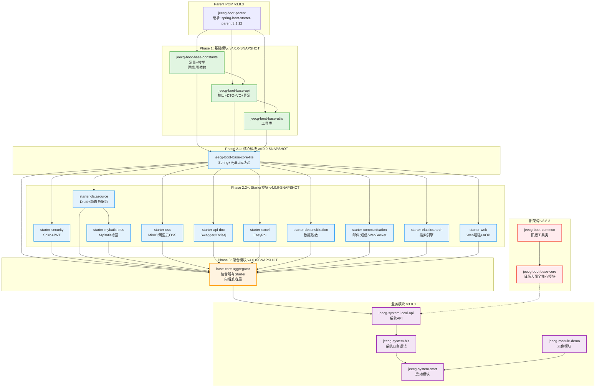
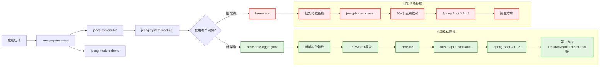
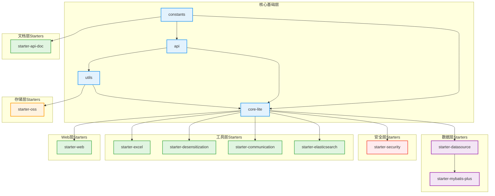
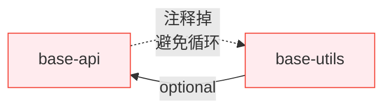
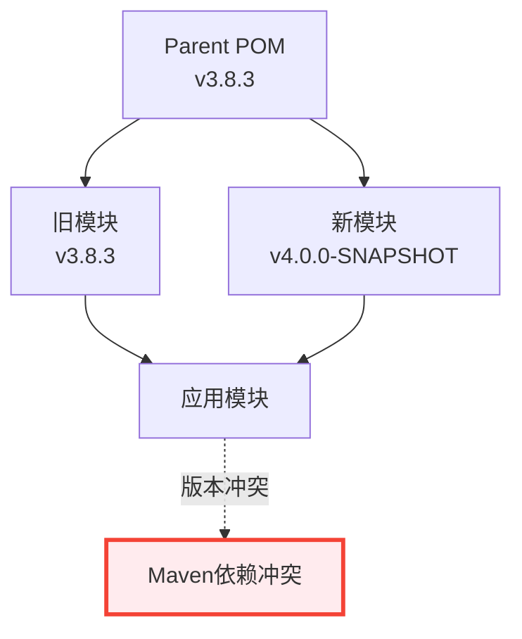
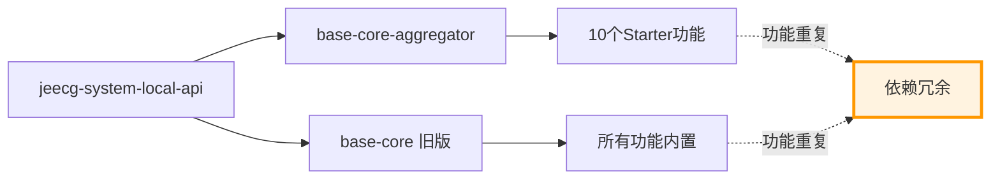
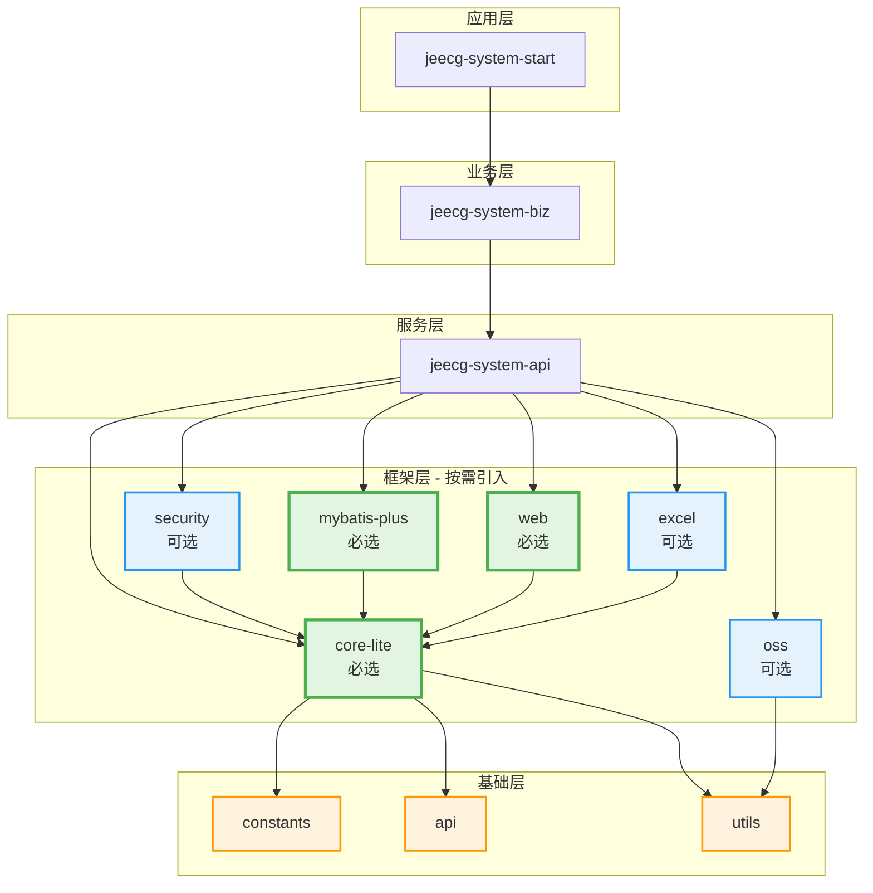
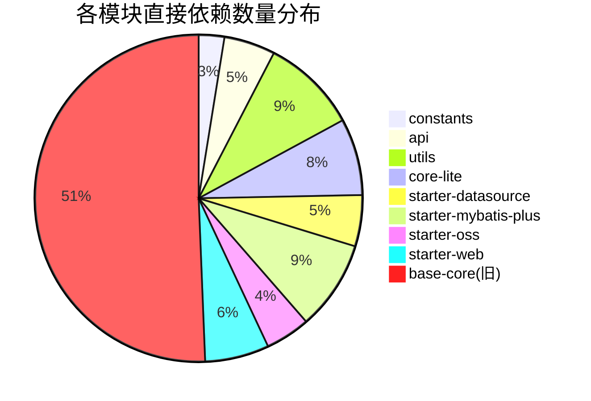
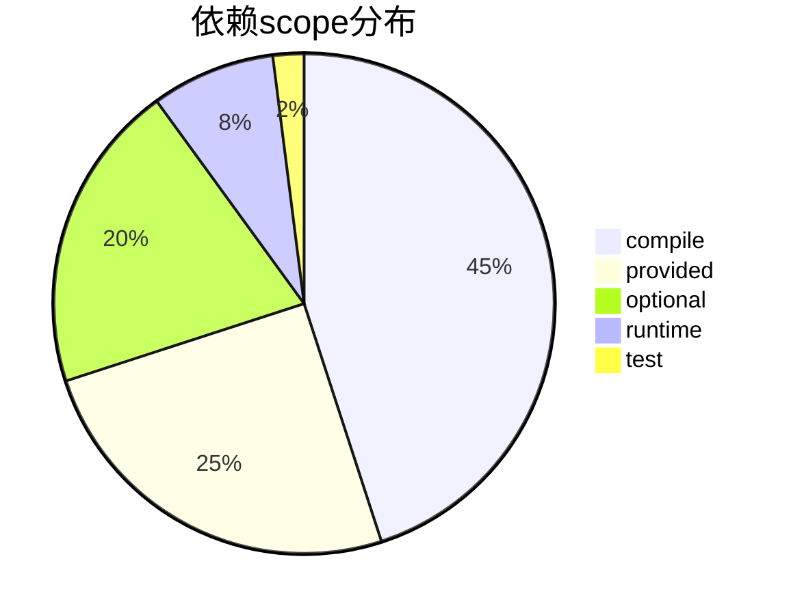

# JeecgBoot 项目依赖关系可视化图

> 生成时间: 2025-11-09  
> 使用Mermaid语法，可在支持的Markdown编辑器中查看

---

## 📊 1. 完整模块依赖关系图



---

## 🔄 2. 依赖传递链路图



---

## 🎯 3. Starter模块内部依赖图



---

## 📦 4. 第三方库依赖分布图

```mermaid
graph TB
    subgraph "Spring生态"
        SB[Spring Boot 3.1.12]
        SW[spring-web]
        SA[spring-aop]
        SR[spring-data-redis]
    end
    
    subgraph "数据库层"
        MP[MyBatis-Plus 3.5.5]
        Druid[Druid 1.2.24]
        DDS[Dynamic-Datasource 4.3.1]
        MySQL[MySQL Driver]
        PG[PostgreSQL Driver]
    end
    
    subgraph "工具库"
        Hutool[Hutool 5.8.25]
        FastJSON[FastJSON 2.0.57]
        Commons[Apache Commons]
    end
    
    subgraph "安全框架"
        Shiro[Shiro 2.0.4]
        JWT[Java-JWT 4.5.0]
    end
    
    subgraph "存储服务"
        MinIO[MinIO 8.5.7]
        OSS[Aliyun OSS 3.17.4]
    end
    
    subgraph "API文档"
        Knife4j[Knife4j 4.5.0]
        SpringDoc[SpringDoc 2.6.0]
    end
    
    subgraph "Excel处理"
        EasyPoi[EasyPoi 4.4.0]
    end
    
    subgraph "其他"
        Lombok[Lombok]
        FreeMarker[FreeMarker]
        Quartz[Quartz]
    end
    
    CoreLite[jeecg-boot-base-core-lite] --> SB
    CoreLite --> MP
    
    StarterDS[starter-datasource] --> Druid
    StarterDS --> DDS
    
    StarterMP[starter-mybatis-plus] --> MP
    
    StarterSec[starter-security] --> Shiro
    StarterSec --> JWT
    
    StarterOSS[starter-oss] --> MinIO
    StarterOSS --> OSS
    
    StarterDoc[starter-api-doc] --> Knife4j
    StarterDoc --> SpringDoc
    
    StarterExcel[starter-excel] --> EasyPoi
    
    Utils[base-utils] --> Hutool
    Utils --> FastJSON
    Utils --> Commons
```



---

## ⚠️ 5. 问题依赖关系图

### 5.1 循环依赖风险



**说明**: 
- 实线箭头: 实际依赖
- 虚线箭头: 被注释掉的依赖
- 红色: 存在问题的模块

### 5.2 版本冲突图



### 5.3 依赖冗余图



---

## 🎨 6. 优化后的理想架构图



---

## 📈 7. 依赖数量统计图

### 7.1 各模块依赖数量



### 7.2 依赖类型分布



---

## 🔍 8. 关键路径分析

### 8.1 启动依赖关键路径

```mermaid
graph LR
    Start([应用启动]) --> S1[system-start]
    S1 --> S2[system-biz]
    S2 --> S3[system-local-api]
    S3 --> 