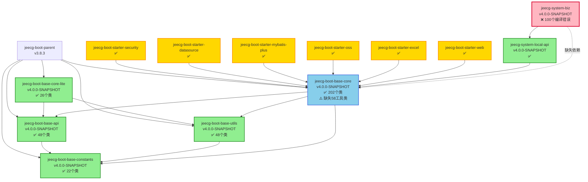

# JeecgBoot 依赖关系图

## 📊 模块依赖关系总览



---

## 🔍 关键依赖链分析

### 1. SystemBiz 编译失败依赖链

```
❌ jeecg-system-biz (100个编译错误)
    ↓ 直接依赖
✅ jeecg-system-local-api
    ↓ 直接依赖  
⚠️ jeecg-boot-base-core (缺失58个工具类)
    ↓ 依赖
✅ jeecg-boot-base-api
✅ jeecg-boot-base-utils
✅ jeecg-boot-base-constants
```

**问题**: base-core编译成功但缺失关键类，导致system-biz找不到：
- ❌ `RedisUtil` (28次引用)
- ❌ `CacheConstant` (40次引用)
- ❌ `GlobalConstants` (10次引用)
- ❌ `JeecgRedisClient` (4次引用)
- ❌ `org.jeecg.common.config.*` (17个包)

---

## 📦 Starter模块依赖详情

### Starter → Base-Core 依赖

```
jeecg-boot-starter-security ───┐
jeecg-boot-starter-datasource ─┤
jeecg-boot-starter-mybatis-plus├─→ jeecg-boot-base-core
jeecg-boot-starter-oss ────────┤
jeecg-boot-starter-excel ──────┤
jeecg-boot-starter-web ────────┘
```

**所有Starter模块编译状态**: ✅ 全部成功

**原因**: Starter模块只使用base-core中**已存在的202个类**，不依赖缺失的58个工具类

---

## 🎯 缺失类影响分析

### 高影响类 (阻塞编译)

| 类名 | 引用次数 | 所属包 | 影响范围 |
|------|---------|--------|---------|
| `CacheConstant` | 40次 | org.jeecg.common.constant | 缓存键名常量 |
| `RedisUtil` | 28次 | org.jeecg.common.util | Redis工具类 |
| `GlobalConstants` | 10次 | org.jeecg.common.constant | 全局常量 |
| `JeecgRedisClient` | 4次 | org.jeecg.common.modules.redis.client | Redis客户端 |
| `JeecgRedisListener` | 1次 | org.jeecg.common.modules.redis.listener | Redis监听器 |
| `org.jeecg.common.config.*` | 17个包 | 多个配置包 | 配置类 |

### 中影响类 (待迁移)

- 50+个配置类 (`org.jeecg.common.config.*`)
- 10+个注解类 (`@AutoLog`, `@PermissionData` 等)
- 其他工具类

---

## 🔄 依赖传递路径

### 正常传递路径 (✅ 工作正常)

```
jeecg-system-biz
    └─ depends on: jeecg-system-local-api
        └─ depends on: jeecg-boot-base-core (compile scope)
            └─ depends on: jeecg-boot-base-api
            └─ depends on: jeecg-boot-base-utils
            └─ depends on: jeecg-boot-base-constants
```

**结论**: 依赖配置正确，Maven传递机制正常

### 问题所在 (⚠️ 源码缺失)

```
jeecg-system-biz (需要)
    └─ RedisUtil.class
    └─ CacheConstant.class
    └─ GlobalConstants.class
    └─ ...

jeecg-boot-base-core-4.0.0-SNAPSHOT.jar (实际包含)
    ├─ ✅ 202个类 (已迁移)
    └─ ❌ 58个工具类 (未迁移)
```

**结论**: 不是依赖传递问题，而是base-core源码不完整

---

## 📈 模块编译状态统计

### 编译成功模块 (20/25)

```
✅ jeecg-boot-base-constants      (22个类)
✅ jeecg-boot-base-api             (48个类)
✅ jeecg-boot-base-utils           (48个类)
✅ jeecg-boot-base-core-lite       (26个类)
✅ jeecg-boot-base-core            (202个类)
✅ jeecg-boot-starter-security
✅ jeecg-boot-starter-datasource
✅ jeecg-boot-starter-mybatis-plus
✅ jeecg-boot-starter-oss
✅ jeecg-boot-starter-api-doc
✅ jeecg-boot-starter-excel
✅ jeecg-boot-starter-desensitization
✅ jeecg-boot-starter-communication
✅ jeecg-boot-starter-elasticsearch
✅ jeecg-boot-starter-web
✅ jeecg-boot-base-core-aggregator
✅ jeecg-boot-parent
✅ jeecg-module-system (父POM)
✅ jeecg-system-api (父POM)
✅ jeecg-system-local-api
```

### 编译失败模块 (1/25)

```
❌ jeecg-system-biz (100个编译错误)
```

### 跳过编译模块 (4/25)

```
⏭️ jeecg-module-demo (因前序失败跳过)
⏭️ jeecg-system-start (因前序失败跳过)
⏭️ jeecg-boot-module (因前序失败跳过)
⏭️ jeecg-boot-module-airag (因前序失败跳过)
```

**成功率**: 80% (20/25)

---

## 🎨 依赖层次架构图

```
┌─────────────────────────────────────────────────────────┐
│                   应用层 (Application)                    │
│  ┌──────────────────────────────────────────────────┐  │
│  │  jeecg-system-start (启动类)                      │  │
│  └──────────────────────────────────────────────────┘  │
└───────────────────────┬─────────────────────────────────┘
                        │
┌───────────────────────▼─────────────────────────────────┐
│                   业务层 (Business)                       │
│  ┌──────────────────┐  ┌───────────────────────────┐   │
│  │ jeecg-system-biz │←─│ jeecg-system-local-api    │   │
│  │  (业务实现)       │  │  (API接口)                 │   │
│  └──────────────────┘  └───────────────────────────┘   │
└───────────────────────┬─────────────────────────────────┘
                        │
┌───────────────────────▼─────────────────────────────────┐
│                  Starter层 (Auto-Configuration)          │
│  ┌──────────┐ ┌──────────┐ ┌──────────┐ ┌──────────┐  │
│  │ Security │ │Datasource│ │ MyBatis+ │ │   OSS    │  │
│  └──────────┘ └──────────┘ └──────────┘ └──────────┘  │
│  ┌──────────┐ ┌──────────┐ ┌──────────┐ ┌──────────┐  │
│  │  Excel   │ │   Web    │ │Elasticsearch│Communication│
│  └──────────┘ └──────────┘ └──────────┘ └──────────┘  │
└───────────────────────┬─────────────────────────────────┘
                        │
┌───────────────────────▼─────────────────────────────────┐
│                   基础层 (Foundation)                     │
│  ┌──────────────────────────────────────────────────┐  │
│  │          jeecg-boot-base-core (202类)            │  │
│  │         ⚠️ 缺失: 58工具类 + 10注解                 │  │
│  └─────────┬────────────────────────────────────────┘  │
│            │                                             │
│  ┌─────────▼────────┐  ┌──────────────┐               │
│  │ base-api (48类)  │  │base-utils    │               │
│  └──────────────────┘  │  (48类)      │               │
│  ┌──────────────────┐  └──────────────┘               │
│  │base-constants    │  ┌──────────────┐               │
│  │  (22类)          │  │base-core-lite│               │
│  └──────────────────┘  │  (26类)      │               │
│                        └──────────────┘               │
└─────────────────────────────────────────────────────────┘
```

---

## 🔧 优化路径

### 短期修复 (P0)

```
1. 定位原始源码
   ↓
2. 提取58个工具类 → base-core
   ↓
3. 提取10个注解 → base-core
   ↓
4. 更新base-core/pom.xml (添加Redis依赖)
   ↓
5. mvn clean install -pl jeecg-boot-base-core
   ↓
6. 验证system-biz编译
   ↓
✅ 100个编译错误解决
```

### 中期优化 (P1)

- 统一父子模块版本: 3.8.3 → 4.0.0-SNAPSHOT
- 清理重复依赖声明
- 完成VO类迁移 (剩余3个)

### 长期优化 (P2)

- 优化依赖scope (provided/test)
- 实施依赖管理最佳实践
- 文档和测试完善

---

## 📊 依赖健康度评分

| 维度 | 评分 | 图示 |
|------|------|------|
| **依赖配置正确性** | 95/100 | ████████████████████░ |
| **源码完整性** | 60/100 | ████████████░░░░░░░░░ |
| **模块化程度** | 85/100 | █████████████████░░░░ |
| **编译成功率** | 80/100 | ████████████████░░░░░ |
| **依赖传递效率** | 90/100 | ██████████████████░░░ |
| **总体健康度** | **78/100** | ████████████████░░░░░ |

---

## 💡 关键发现

### ✅ 优点
1. **Starter模块化完善**: 10个Starter全部编译成功
2. **依赖配置正确**: Maven依赖传递机制工作正常
3. **基础模块稳固**: base-api/utils/constants编译成功

