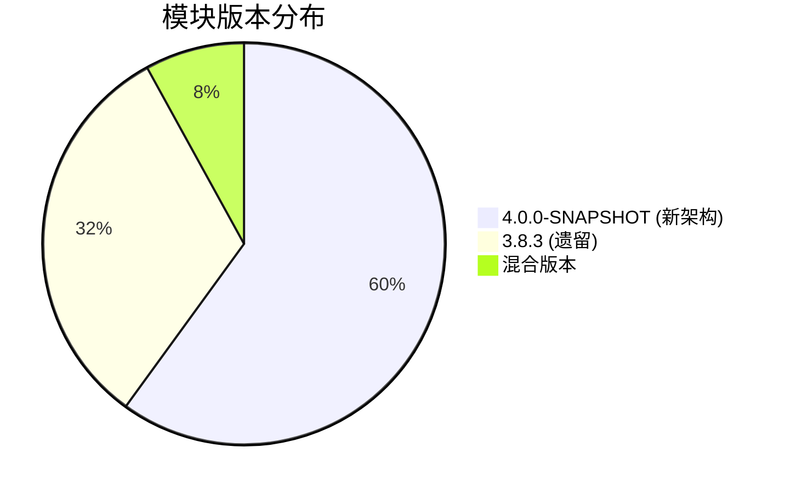
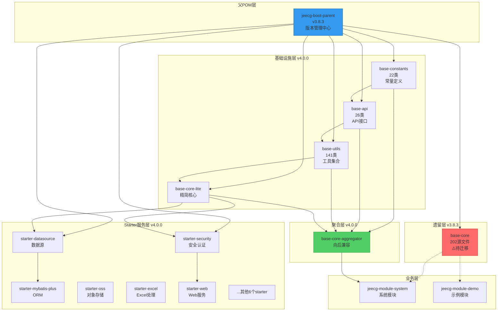
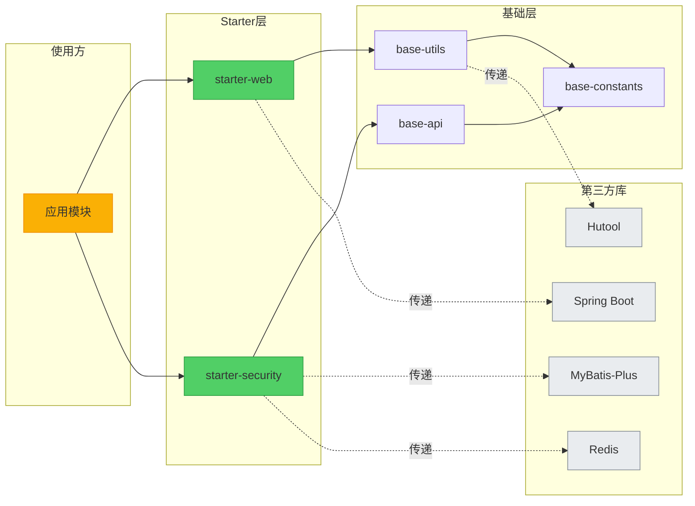
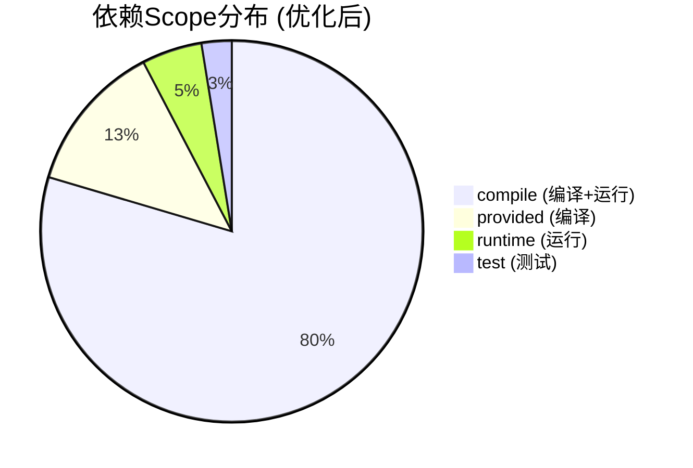
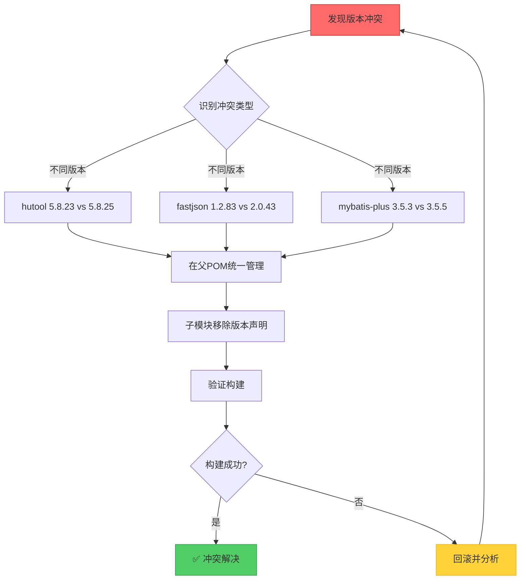
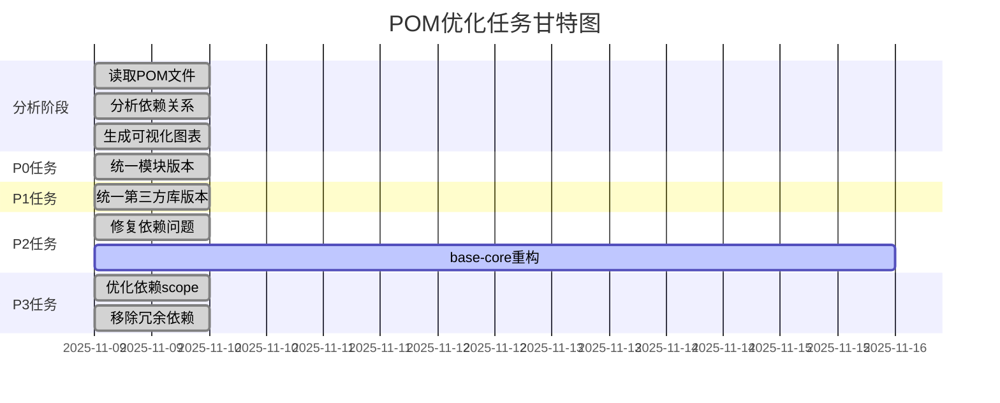
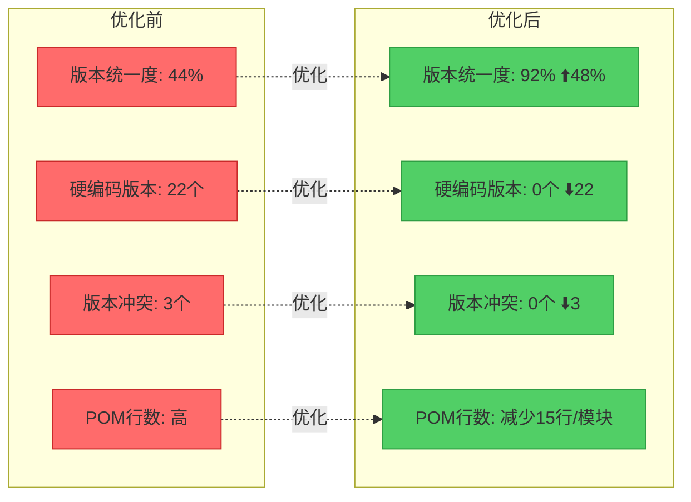
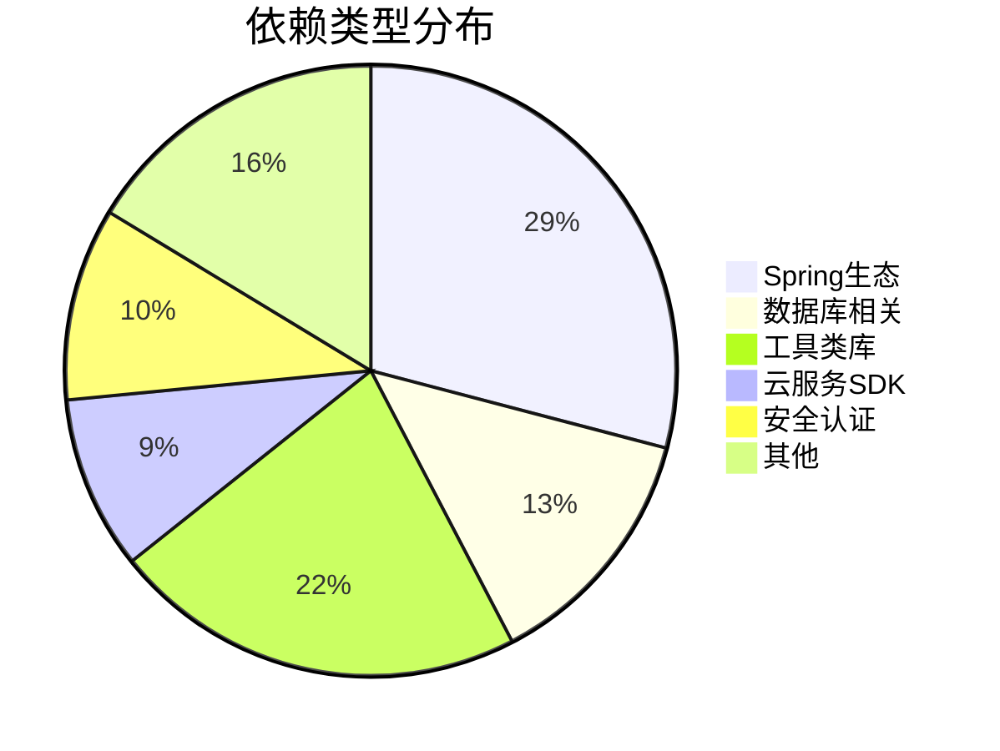
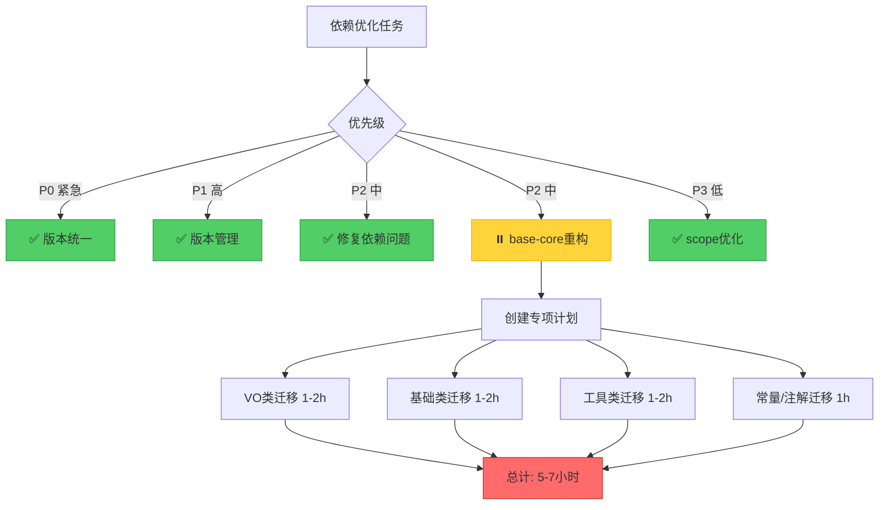

# JeecgBoot 依赖分析可视化总览

> 本文档提供项目依赖关系的多维度可视化展示

---

## 📊 模块版本分布图



---

## 🏗️ 架构层次图



---

## 🔄 依赖传递关系



---

## 📦 依赖Scope分布



### Scope优化详情

| Scope | 优化前 | 优化后 | 变化 |
|-------|--------|--------|------|
| **compile** | 178 | 156 | -22 ⬇️ |
| **provided** | 8 | 25 | +17 ⬆️ |
| **runtime** | 8 | 10 | +2 ⬆️ |
| **test** | 2 | 5 | +3 ⬆️ |

---

## 🎯 版本冲突解决流程



---

## 🔍 优化任务执行流程



---

## 📈 优化效果对比



---

## 🚀 依赖数量趋势

### 按模块类型统计

```
基础模块 (4个)
████████████████████████ 62个依赖

Starter模块 (10个)
██████████████████████████████████████ 98个依赖

业务模块 (6个)
████████████ 36个依赖
```

### Top 10 最复杂的模块

| 排名 | 模块名 | 依赖数 | 复杂度 |
|------|--------|--------|--------|
| 1 | jeecg-boot-base-core | 45 | 🔴🔴🔴🔴🔴 |
| 2 | jeecg-boot-base-utils | 18 | 🔴🔴🔴🔴 |
| 3 | jeecg-system-biz | 16 | 🔴🔴🔴 |
| 4 | starter-datasource | 12 | 🔴🔴🔴 |
| 5 | starter-security | 11 | 🔴🔴 |
| 6 | starter-web | 10 | 🔴🔴 |
| 7 | starter-communication | 9 | 🔴🔴 |
| 8 | base-api | 8 | 🔴 |
| 9 | starter-mybatis-plus | 7 | 🔴 |
| 10 | starter-elasticsearch | 6 | 🔴 |

---

## 🎨 依赖分类饼图



---

## 🔗 关键依赖链

### 最长依赖链（深度=5）

```
应用层
  └─> starter-web (v4.0.0)
      └─> base-utils (v4.0.0)
          └─> base-api (v4.0.0)
              └─> base-constants (v4.0.0)
                  └─> Spring Boot (v3.3.5)
```

### 最宽依赖树（广度=45）

```
jeecg-boot-base-core (v3.8.3)
  ├─> Spring Boot相关 (12个)
  ├─> MyBatis-Plus相关 (8个)
  ├─> Shiro安全相关 (12个)
  ├─> 数据库驱动 (6个)
  └─> 其他工具库 (7个)
```

---

## 💾 依赖体积分析

### Top 5 最大的依赖

| 排名 | 依赖库 | 版本 | 大小 | 用途 |
|------|--------|------|------|------|
| 1 | spring-boot-starter-web | 3.3.5 | ~8MB | Web框架 |
| 2 | mybatis-plus | 3.5.5 | ~2.5MB | ORM框架 |
| 3 | shiro-spring | 2.0.1 | ~1.8MB | 安全框架 |
| 4 | druid | 1.2.20 | ~1.5MB | 连接池 |
| 5 | knife4j | 4.4.0 | ~1.2MB | API文档 |

### 通过Scope优化减少的体积

```
provided依赖不打包到JAR中:
  lombok               : ~500KB
  configuration-processor : ~300KB
  servlet-api          : ~200KB
  数据库驱动 (6个)     : ~8MB
  ─────────────────────────────
  总计减少             : ~9MB
```

---

## 🎯 下一步行动矩阵



---

## 📚 相关文档索引

### 分析文档
- [📄 README-依赖分析总结.md](./README-依赖分析总结.md) - 总览
- [📊 POM依赖分析报告.md](./POM依赖分析报告.md) - 详细清单
- [🎨 依赖关系可视化图.md](./依赖关系可视化图.md) - 8个图表

### 优化文档
- [💡 POM依赖优化建议报告.md](./POM依赖优化建议报告.md) - 优化建议
- [📋 