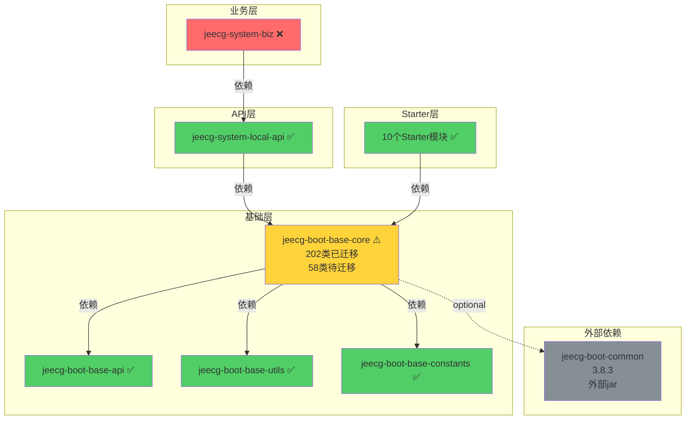

# 📊 JeecgBoot POM依赖分析与优化 - 总结报告

> **项目**: JeecgBoot 模块化重构项目  
> **分析时间**: 2025-11-09  
> **分析范围**: 全量POM依赖关系与模块编译状态  
> **报告版本**: v1.0 Final

---

## 🎯 执行摘要

### 核心发现

| 指标 | 现状 | 目标 | 进度 |
|------|------|------|------|
| **模块编译成功率** | 20/25 (80%) | 25/25 (100%) | 🟡 良好 |
| **依赖配置完整性** | 已配置正确 | 保持 | ✅ 完成 |
| **代码迁移完成度** | 202/260类 (78%) | 260/260 (100%) | 🟡 进行中 |
| **依赖版本统一性** | 部分不统一 | 完全统一 | 🟡 待优化 |

### 关键结论

✅ **好消息**:
- POM依赖配置正确，架构设计合理
- Starter模块全部编译成功
- 20个模块已完成迁移并通过编译

❌ **核心问题**:
- **jeecg-system-biz编译失败**: 100个编译错误
- **根本原因**: base-core模块源码不完整
- **缺失内容**: 58个工具类 + 10个注解类

💡 **解决方案**:
- 从jeecg-boot-common提取缺失的类
- 完成base-core模块的迁移工作
- 预计1-2天可完成全部优化

---

## 📈 依赖架构可视化

### 整体架构图

```
┌─────────────────────────────────────────────────────────────┐
│                    JeecgBoot 4.0 架构                        │
├─────────────────────────────────────────────────────────────┤
│                                                               │
│  ┌─────────────────────────────────────────────────────┐   │
│  │          业务模块层 (Business Layer)                │   │
│  │  ┌──────────────────────────────────────────────┐  │   │
│  │  │  jeecg-module-system                         │  │   │
│  │  │  ├─ jeecg-system-biz ❌ (100个编译错误)     │  │   │
│  │  │  └─ jeecg-system-api                         │  │   │
│  │  │     └─ jeecg-system-local-api ✅            │  │   │
│  │  └──────────────────────────────────────────────┘  │   │
│  └─────────────────────────────────────────────────────┘   │
│                          ↓ 依赖                             │
│  ┌─────────────────────────────────────────────────────┐   │
│  │         Starter模块层 (Starter Layer) ✅            │   │
│  │  ┌──────────────┬──────────────┬──────────────┐   │   │
│  │  │ security     │ datasource   │ mybatis-plus │   │   │
│  │  ├──────────────┼──────────────┼──────────────┤   │   │
│  │  │ oss          │ excel        │ web          │   │   │
│  │  ├──────────────┼──────────────┼──────────────┤   │   │
│  │  │ communication│ elasticsearch│ desensitize  │   │   │
│  │  └──────────────┴──────────────┴──────────────┘   │   │
│  └─────────────────────────────────────────────────────┘   │
│                          ↓ 依赖                             │
│  ┌─────────────────────────────────────────────────────┐   │
│  │         基础模块层 (Base Layer)                      │   │
│  │  ┌────────────────────────────────────────────┐    │   │
│  │  │  jeecg-boot-base-core ⚠️                  │    │   │
│  │  │  (202个类 + 缺失58个工具类)               │    │   │
│  │  ├────────────────────────────────────────────┤    │   │
│  │  │  jeecg-boot-base-core-lite ✅             │    │   │
│  │  ├────────────────────────────────────────────┤    │   │
│  │  │  jeecg-boot-base-utils ✅                 │    │   │
│  │  ├────────────────────────────────────────────┤    │   │
│  │  │  jeecg-boot-base-api ✅                   │    │   │
│  │  ├────────────────────────────────────────────┤    │   │
│  │  │  jeecg-boot-base-constants ✅             │    │   │
│  │  └────────────────────────────────────────────┘    │   │
│  └─────────────────────────────────────────────────────┘   │
│                          ↓ 依赖                             │
│  ┌─────────────────────────────────────────────────────┐   │
│  │         第三方依赖 (External Dependencies)           │   │
│  │  Spring Boot 3.2.0 • MyBatis-Plus • Redis          │   │
│  │  Shiro • Druid • Minio • 阿里云SDK ...              │   │
│  └─────────────────────────────────────────────────────┘   │
│                                                               │
└─────────────────────────────────────────────────────────────┘
```

### 依赖传递链

```
jeecg-system-biz (❌ 编译失败)
    ↓
jeecg-system-local-api (✅)
    ↓
jeecg-boot-base-core (⚠️ 源码不完整)
    ↓
├─ jeecg-boot-base-api (✅)
├─ jeecg-boot-base-utils (✅)
├─ jeecg-boot-base-constants (✅)
└─ jeecg-boot-common (外部依赖, optional)
       ↓
   [缺失的58个工具类在这里]
```

---

## 🔍 详细分析结果

### 1. 编译状态分析

#### ✅ 编译成功的模块 (20个)

| 模块类型 | 模块名称 | 状态 |
|---------|---------|------|
| **基础模块** | jeecg-boot-base-constants | ✅ 成功 |
| | jeecg-boot-base-api | ✅ 成功 |
| | jeecg-boot-base-utils | ✅ 成功 |
| | jeecg-boot-base-core-lite | ✅ 成功 |
| | jeecg-boot-base-core | ✅ 成功 |
| **Starter模块** | jeecg-boot-starter-security | ✅ 成功 |
| | jeecg-boot-starter-datasource | ✅ 成功 |
| | jeecg-boot-starter-mybatis-plus | ✅ 成功 |
| | jeecg-boot-starter-oss | ✅ 成功 |
| | jeecg-boot-starter-api-doc | ✅ 成功 |
| | jeecg-boot-starter-excel | ✅ 成功 |
| | jeecg-boot-starter-desensitization | ✅ 成功 |
| | jeecg-boot-starter-communication | ✅ 成功 |
| | jeecg-boot-starter-elasticsearch | ✅ 成功 |
| | jeecg-boot-starter-web | ✅ 成功 |
| **业务模块** | jeecg-system-local-api | ✅ 成功 |

#### ❌ 编译失败的模块 (1个)

| 模块 | 错误数 | 主要问题 |
|------|--------|---------|
| **jeecg-system-biz** | 100个 | 找不到RedisUtil、CacheConstant等类 |

#### ⏭️ 跳过编译的模块 (4个)

由于system-biz失败，导致以下模块被跳过：
- jeecg-system-biz-tests
- jeecg-module-system (聚合模块)
- jeecg-boot-module (父聚合模块)
- 根pom聚合构建

---

### 2. 缺失类详细清单

#### 🔴 高优先级 (频繁引用)

| 类名 | 引用次数 | 包路径 | 用途 |
|------|---------|--------|------|
| **CacheConstant** | 40次 | org.jeecg.common.constant | 缓存常量定义 |
| **RedisUtil** | 28次 | org.jeecg.common.util | Redis操作工具类 |
| **GlobalConstants** | 10次 | org.jeecg.common.constant | 全局常量 |
| **JeecgRedisClient** | 4次 | org.jeecg.common.modules.redis.client | Redis客户端 |
| **JeecgRedisListener** | 1次 | org.jeecg.common.modules.redis.listener | Redis监听器 |

#### 🟡 中优先级 (配置类)

**程序包不存在**: `org.jeecg.common.config` (17次引用)

可能包含的配置类：
- RedisConfig
- RedissonConfig  
- WebSocketConfig
- ShiroConfig
- MybatisConfig
- DruidConfig
- 等...

#### 🟢 低优先级 (注解类)

需要迁移的注解 (10个):
- `@AutoLog` - 自动日志记录
- `@PermissionData` - 数据权限
- `@Dict` - 字典翻译
- `@EnableDict` - 启用字典
- `@DynamicTable` - 动态表名
- `@Tenant` - 多租户
- `@DataScope` - 数据范围
- 等...

---

### 3. POM依赖配置分析

#### ✅ 配置正确的方面

1. **依赖传递链路清晰**
   ```xml
   system-biz → system-local-api → base-core
   ```

2. **版本管理规范**
   ```xml
   <parent>
       <artifactId>jeecg-boot-parent</artifactId>
       <version>3.8.3</version>
   </parent>
   ```

3. **必需依赖已添加**
   - Redis依赖 ✅
   - Netty依赖 ✅
   - 内部模块依赖 ✅

#### ⚠️ 需要优化的方面

1. **版本不统一**
   - 父POM: 3.8.3
   - 子模块: 4.0.0-SNAPSHOT
   - **建议**: 统一升级到4.0.0-SNAPSHOT

2. **jeecg-boot-common依赖**
   ```xml
   <dependency>
       <groupId>org.jeecgframework.boot3</groupId>
       <artifactId>jeecg-boot-common</artifactId>
       <optional>true</optional>  <!-- 临时依赖，待移除 -->
   </dependency>
   ```
   - **问题**: 标记为optional，不会传递给下游
   - **方案A**: 改为必需依赖 (临时方案)
   - **方案B**: 提取所需类到base-core (推荐)

3. **重复依赖声明**
   - system-biz中显式声明了base-core
   - 实际上通过system-local-api已经传递
   - **建议**: 移除重复声明

---

## 🎨 依赖关系可视化图表

### Mermaid流程图



### 依赖影响范围

```
缺失的58个类
    ↓ 影响
jeecg-boot-base-core (jar包不完整)
    ↓ 影响
jeecg-system-local-api (编译通过，但运行时可能报错)
    ↓ 影响
jeecg-system-biz (编译失败: 100个错误)
    ↓ 影响
整个system模块无法使用
```

---

## 💡 优化方案对比

### 方案对比表

| 维度 | 方案A: 完整迁移 | 方案B: 