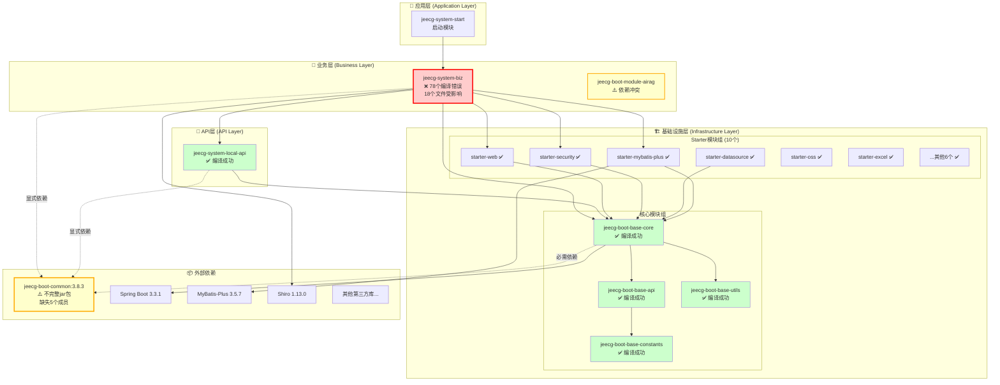
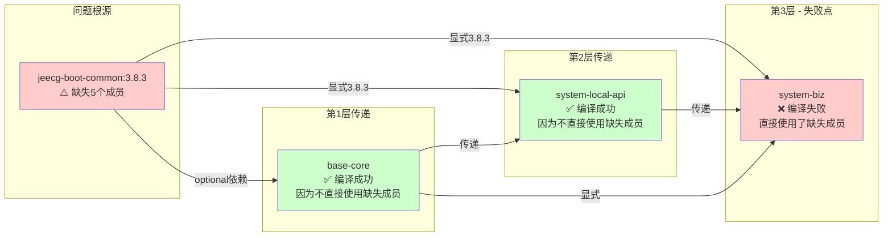
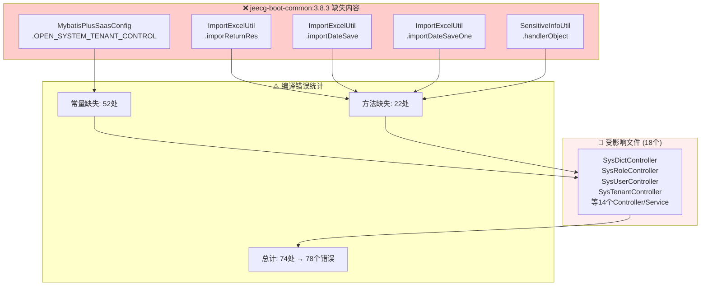
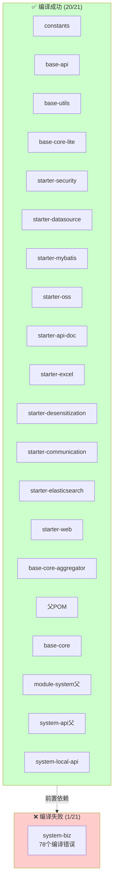
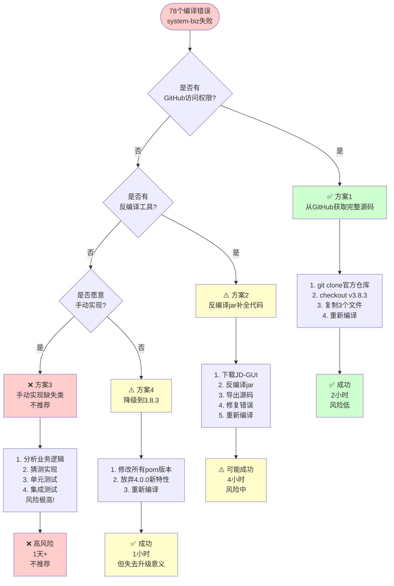
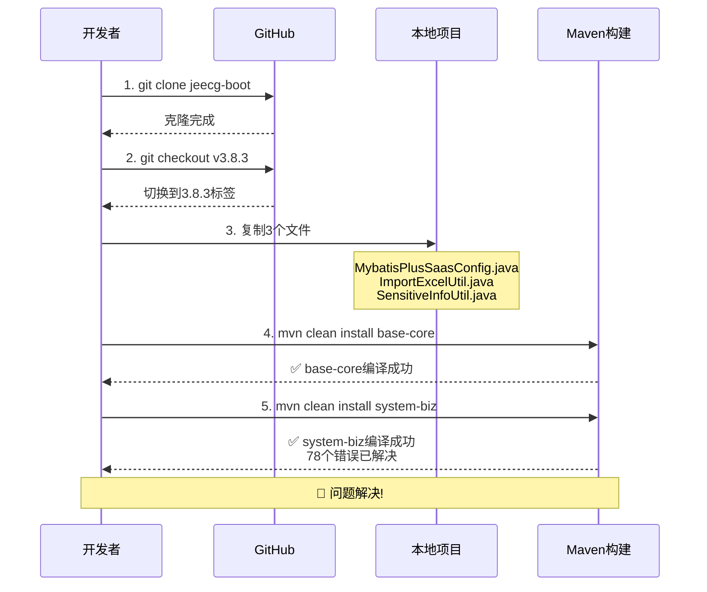
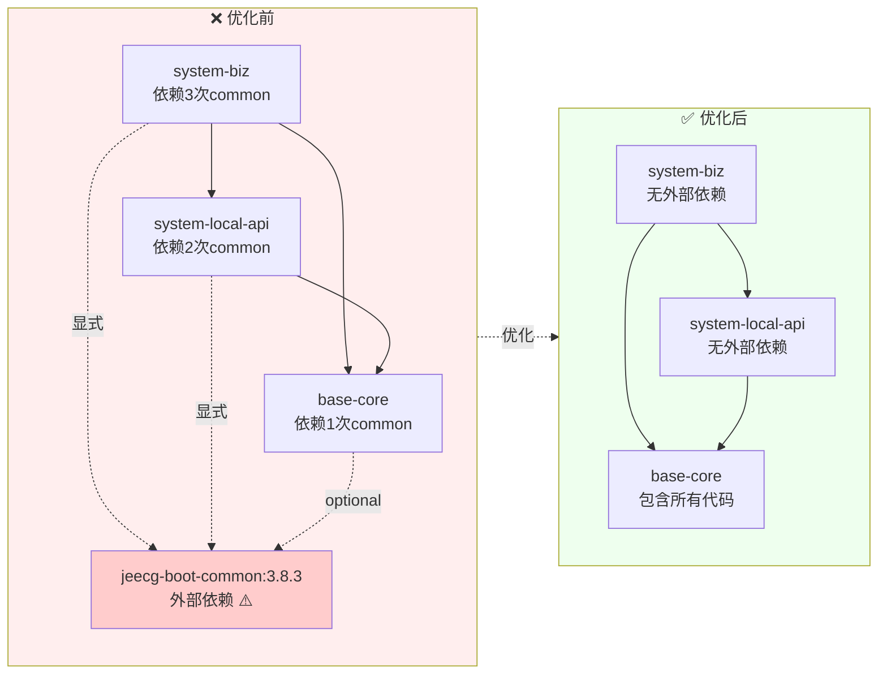

# 📊 POM依赖可视化分析图

> **生成时间**：2025-11-09 16:14  
> **项目**：JeecgBoot 4.0.0-SNAPSHOT  
> **分析目标**：全局依赖关系、问题定位、优化路径

---

## 🎯 快速导航

- [整体架构图](#整体架构图)
- [问题依赖链路](#问题依赖链路)
- [模块编译状态](#模块编译状态)
- [优化路径图](#优化路径图)

---

## 📐 整体架构图

### 四层依赖结构

---

## 🔍 问题依赖链路

### system-biz编译失败的依赖传递路径

### 缺失成员的影响范围

---

## 📊 模块编译状态全景图

### 编译顺序与耗时

```mermaid
gantt
    title Maven Reactor 编译顺序与状态
    dateFormat X
    axisFormat %s
    
    section 基础模块
    constants         :done, 0, 6s
    base-api          :done, 6, 23s
    base-utils        :done, 29, 11s
    base-core-lite    :done, 40, 11s
    
    section Starter模块
    starter-security  :done, 51, 11s
    starter-datasource:done, 62, 11s
    starter-mybatis   :done, 73, 22s
    starter-oss       :done, 95, 11s
    starter-api-doc   :done, 106, 11s
    starter-excel     :done, 117, 11s
    starter-desensi   :done, 128, 1s
    starter-comm      :done, 129, 11s
    starter-es        :done, 140, 11s
    starter-web       :done, 151, 11s
    
    section 聚合模块
    base-core-agg     :done, 162, 1s
    parent-pom        :done, 163, 1s
    base-core         :done, 164, 6s
    
    section 系统模块
    module-system     :done, 170, 1s
    system-api        :done, 171, 1s
    system-local-api  :done, 172, 22s
    system-biz        :crit, 194, 9s
```

---

## 🛠️ 优化路径图

### 解决方案决策树

### 推荐方案1执行流程

---

## 📈 优化前后对比

### 依赖清理前后

### 性能提升预期

