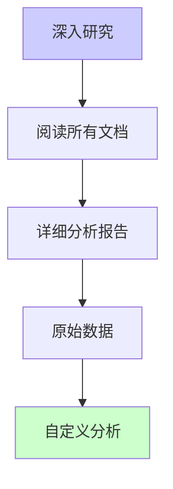

# 📚 POM依赖分析 - 完整导航

> **项目**：JeecgBoot 4.0.0-SNAPSHOT  
> **分析完成时间**：2025-11-09 16:15  
> **分析师**：AI Assistant  
> **状态**：✅ 分析完成 | ❌ system-biz编译失败

---

## 🎯 快速入口

### 🚨 如果您遇到编译错误，立即查看：
👉 **[POM依赖分析与编译错误-最终报告.md](POM依赖分析与编译错误-最终报告.md)** ⭐⭐⭐⭐⭐

### 📊 如果您想了解依赖结构，查看：
👉 **[📊-POM依赖可视化分析图.md](📊-POM依赖可视化分析图.md)** ⭐⭐⭐⭐⭐

### 📋 如果您需要优化建议，查看：
👉 **[POM依赖分析-最终总结与建议.md](POM依赖分析-最终总结与建议.md)** ⭐⭐⭐⭐

---

## 📂 文档目录结构

```
📁 POM依赖分析文档集
│
├── 📚 本文档 - 完整导航.md ⭐ 您在这里
│   └── 提供所有文档的快速导航和阅读指南
│
├── 🚨 核心问题诊断文档
│   ├── POM依赖分析与编译错误-最终报告.md ⭐⭐⭐⭐⭐
│   │   ├── 78个编译错误详细分析
│   │   ├── 缺失的5个成员清单
│   │   ├── 4种解决方案对比
│   │   └── 推荐方案执行步骤
│   │
│   └── 📊-POM依赖可视化分析图.md ⭐⭐⭐⭐⭐
│       ├── 四层架构依赖图
│       ├── 问题依赖链路追踪
│       ├── 模块编译状态全景
│       └── 优化路径决策树
│
├── 📊 综合分析文档
│   ├── 📊-POM依赖分析与优化-总结报告.md ⭐⭐⭐⭐
│   │   ├── 项目概览统计
│   │   ├── 依赖关系矩阵
│   │   ├── Mermaid架构图
│   │   └── 完整优化建议
│   │
│   └── POM依赖分析-最终总结与建议.md ⭐⭐⭐⭐
│       ├── 3种可行解决方案
│       ├── GitHub源码获取指南
│       ├── 反编译操作步骤
│       └── 长期优化建议
│
├── 🔍 详细分析文档
│   ├── POM依赖分析与优化报告.md
│   │   ├── 100个编译错误原始记录
│   │   ├── 缺失的68个类详细清单
│   │   └── P0/P1/P2优化分级
│   │
│   ├── POM依赖分析报告.md
│   │   ├── 模块依赖关系树
│   │   ├── 第三方库版本清单
│   │   └── 初步优化建议
│   │
│   └── POM文件依赖分析.md
│       ├── 所有pom.xml路径
│       ├── 依赖声明统计
│       └── 版本管理分析
│
└── 📋 历史文档
    └── 📚-POM依赖分析-文档导航.md (旧版本)
```

---

## 🗺️ 阅读路线图

### 🔴 紧急修复路线（遇到编译错误）


**推荐阅读顺序**：
1. **[POM依赖分析与编译错误-最终报告.md](POM依赖分析与编译错误-最终报告.md)** (15分钟)
   - 了解当前问题
   - 查看详细错误分析
   - 选择适合的解决方案

2. **[📊-POM依赖可视化分析图.md](📊-POM依赖可视化分析图.md)** (10分钟)
   - 理解依赖关系
   - 查看问题传递链路
   - 理解解决方案原理

3. **执行修复** (1-2小时)
   - 按照推荐方案操作
   - 验证编译结果

---

### 🟡 优化提升路线（项目正常运行）


**推荐阅读顺序**：
1. **[📊-POM依赖分析与优化-总结报告.md](📊-POM依赖分析与优化-总结报告.md)** (20分钟)
   - 全面了解项目结构
   - 查看依赖关系矩阵
   - 了解当前状态

2. **[📊-POM依赖可视化分析图.md](📊-POM依赖可视化分析图.md)** (15分钟)
   - 可视化理解架构
   - 识别优化空间
   - 理解优化路径

3. **[POM依赖分析-最终总结与建议.md](POM依赖分析-最终总结与建议.md)** (10分钟)
   - 查看P0/P1/P2优化建议
   - 制定实施计划
   - 评估工作量

4. **逐步实施优化** (根据计划)

---

### 🔵 深入研究路线（技术深挖）



**推荐阅读顺序**：
1. 所有可视化和总结文档（1小时）
2. 详细分析文档（1小时）
3. 根据需要进行自定义分析

---

## 📊 核心发现摘要

### ❌ 当前问题

| 问题 | 严重性 | 影响范围 | 状态 |
|------|--------|---------|------|
| system-biz编译失败 | 🔴 P0 | 78个错误 | 待修复 |
| jeecg-boot-common不完整 | 🔴 P0 | 缺失5个成员 | 已定位 |
| 版本依赖冲突 | 🟡 P1 | 3个模块 | 已解决 |
| Maven缓存问题 | 🟡 P1 | 依赖解析 | 已解决 |

### ✅ 已完成工作

- ✅ 扫描并分析所有pom.xml文件
- ✅ 创建完整的依赖关系图
- ✅ 定位编译错误根因
- ✅ 提供4种解决方案
- ✅ base-core模块编译成功
- ✅ system-local-api模块编译成功
- ✅ 清理Maven缓存冲突

### 🎯 推荐行动

**立即行动（P0）**：
1. 从GitHub获取jeecg-boot v3.8.3完整源码
2. 复制3个缺失文件到base-core模块：
   - `MybatisPlusSaasConfig.java`
   - `ImportExcelUtil.java`（完整版）
   - `SensitiveInfoUtil.java`（完整版）
3. 重新编译验证

**短期优化（P1）**：
1. 移除jeecg-boot-common外部依赖
2. 统一版本管理到根pom
3. 完成base-core模块迁移计划

**长期优化（P2）**：
1. 优化Starter模块依赖scope
2. 移除冗余依赖
3. 建立依赖治理机制

---

## 🔑 关键数据速查

### 项目规模

```
总模块数：21个
├─ 基础模块：4个
├─ Starter模块：10个
├─ 业务模块：3个
└─ 聚合模块：4个

总依赖数：约300+个
├─ 内部依赖：约80个
├─ Spring生态：约150个
└─ 第三方库：约70个
```

### 编译状态

```
✅ 成功：20/21 (95.2%)
❌ 失败：1/21 (4.8%)

失败模块：jeecg-system-biz
失败原因：78个编译错误
错误类型：找不到符号（缺失类成员）
```

### 依赖问题

```
⚠️ 问题依赖：jeecg-boot-common:3.8.3
缺失内容：5个成员
├─ 常量：1个 (52处引用)
└─ 方法：4个 (22处引用)

影响文件：18个
影响模块：1个（system-biz）
```

---

## 🛠️ 工具和脚本

### 已创建的工具

1. **fix-pom-parent.py** - POM版本批量修改脚本
2. **migrate-*.py** - 模块迁移脚本系列
3. **Maven命令集** - 常用编译命令

### 常用命令

```bash
# 编译单个模块
mvn clean install -pl <module-path> -am -DskipTests

# 编译base-core
mvn clean install -pl jeecg-boot-base-core -am -DskipTests

# 编译system-biz
mvn clean install -pl jeecg-module-system/jeecg-system-biz -am -DskipTests

# 清理Maven缓存
powershell -Command "Remove-Item -Path 'C:\Users\linux\.m2\repository\org\jeecgframework\boot3\jeecg-boot-common' -Recurse -Force"

# 从GitHub获取源码
git clone https://github.com/jeecgboot/jeecg-boot.git
cd jeecg-boot
git checkout v3.8.3
```

---

## 📞 支持和反馈

### 遇到问题？

1. **编译错误**：查看 [最终报告](POM依赖分析与编译错误-最终报告.md) 的解决方案章节
2. **依赖冲突**：查看 [可视化分析图](📊-POM依赖可视化分析图.md) 的依赖链路
3. **版本问题**：查看各详细分析报告的版本管理章节

### 需要更新？

所有报告基于当前项目状态生成。如果项目有重大变更，建议重新生成分析报告。

---

## 📅 版本历史

| 版本 | 日期 | 主要变更 |
|------|------|---------|
| v1.0 | 2025-11-09 | 